Мой дневник по практике

1\. Подготовительная работа для создания ВМ.

1.1 Проверка поддержки виртуализации, если виртуализация есть, то должен быть такой вывод.

1.2. Установка необходимых пакетов: [**bridge-utils**](https://linuxhint.com/bridge-utils-ubuntu/) (создание моста), [**libvirt-daemon-system**](https://packages.debian.org/unstable/libvirt-daemon-system) (создание ВМ), [**qemu**](https://redos.red-soft.ru/base/arm/os-virtual/qemu-kvm/qemu-kvm/)[ **и** ](https://redos.red-soft.ru/base/arm/os-virtual/qemu-kvm/qemu-kvm/)[**qemu**](https://redos.red-soft.ru/base/arm/os-virtual/qemu-kvm/qemu-kvm/)[**-kvm**](https://redos.red-soft.ru/base/arm/os-virtual/qemu-kvm/qemu-kvm/) (работа гипервизора).

1.3. Активация **libvirtd** для дальнейшей работы.

1.4. Во всяких [**гайдах**](https://ubuntu-admin.ru/ubuntu-kvm/) говорится, что есть три способа настройки доступа виртуальных машин в сеть: через одну из ВМ (самый трудно настраиваемый и еще доп ВМ нужна), через NAT (уже реализован по дефолту **virbr0**), через Bridge (самый обычный и удобный, его и реализуем, не зря ведь **bridge-utils** качали).

Для этого создаем сетевой интерфейс **br0** типа bridge.

Потом все удаляем так как [**оказывается**](https://unix.stackexchange.com/questions/554331/theoretical-tap-interface-w-wifi-parent-interface), что нельзя проводить мост к wifi сети, только к ethernet, потому что Wi-Fi требует дополнительных MAC-адресов для связи, из-за чего принято решение пользоваться NAT :-)

1.5. Установка софта для обновления времени сервера [**chrony**](https://chrony.tuxfamily.org/), для синхронизации времени виртуалок.

2\. Установка образа Centos и создание 3 ВМ с помощью KVM.

2.1. Создание диска с помощью [**qemu-img**](https://docs.altlinux.org/ru-RU/alt-server-v/9.2/html/alt-server-v/ch46s03.html) формата [**qcow2**](https://ru.wikipedia.org/wiki/Qcow2) для монтирования в ВМ (**preallocation=metadata** – выделяет пространство, необходимое для метаданных, но не выделяет место для данных. Это самый быстрый способ представления, но самый медленный для гостевой записи). Папки создал сам, кроме **/mnt**.

2.2. Установка утилит [**virt-install**](https://docs.altlinux.org/ru-RU/alt-server-v/9.2/html/alt-server-v/ch46s02.html) (создание ВМ) и [**osinfo-query**](https://man.archlinux.org/man/community/libosinfo/osinfo-query.1.en) (получение информации о поддержке гипервизорами различных операционных систем) для для создания гостевых машин в среде kvm из командной строки.

2.3. Просмотр доступных для KVM образов Centos с помощью команды **osinfo-query** **os**.

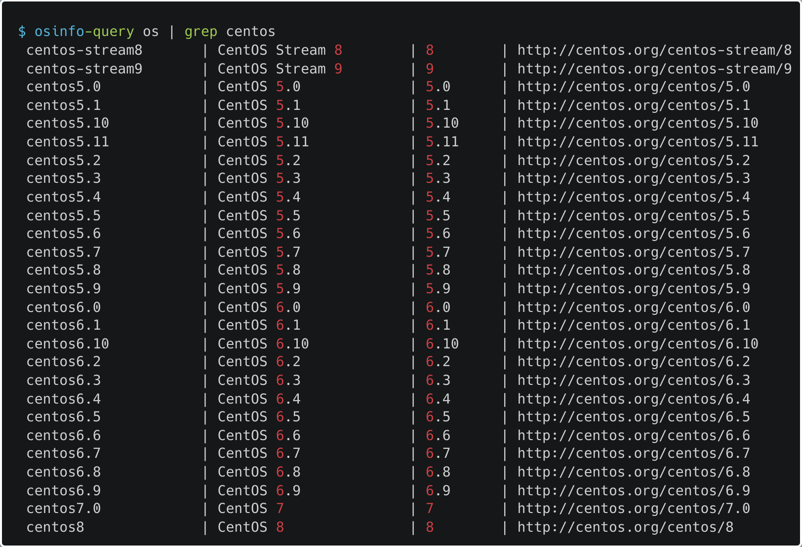

2.4. Установка дистрибутива операционной системы с сайта [**http://mirror.yandex.ru/centos/7.9.2009/isos/x86_64/**](http://mirror.yandex.ru/centos/7.9.2009/isos/x86_64/) В моем случае загружается образ CentOS-7-x86_64-Minimal-2009.iso. Оказалось, что **Centos** крутая штука, так как ворует все идеи у коммерческой **Red Hat Enterprise Linux**, но при этом абсолютно бесплатная.

2.5. Cоздание ВМ с Centos7.0 с помощью **virt-install** ([**сайт**](https://libvirt.org/formatdomain.html#elementsOS) с документацией параметров).

-   **--virt-type kvm** — тип гипервизора
-   **--name VM1** — имя виртуалки
-   **--ram 4096** — оперативка
-   \-**-arch=x86_64** - имитируемая архитектура процессора
-   \-**-disk /mnt/kvm/disk/vm1.qcow2,size=6,format=qcow2** — пространство хранения данных, **size** — размер, **format** — формат тома.
-   **--network network=default** — сетевой интерфейс (**default=virbr0**)
-   \-**-os-type=linux** — тип операционной системы
-   **--os-variant=centos7.0** — конкретный вариант ОС
-   **--location=/mnt/kvm/iso/CentOS-7-x86_64-Minimal-2009.iso** — путь до установочного образа.
-   **--graphics none** — настройки экрана ВМ (**none** — без графического интерфейса)
-   **--console pty,target_type=serial** — тип подкюченя к гостевой консоли (**pty** - обеспечивают работу терминала в оконном интерфейсе, **target_type=serial** — дефолтная консоль, не открывается новое окно)
-   **--extra-args 'console=ttyS0,115200n8 serial'** — дополнительные аргументы, в моем случае параметры консоли в которую будет выводится информация иначе не видать меню загрузки.

2.6. Настройка с помощью меню установки **Centos** без графического интерфейса (в первый раз не понял,что за фигня и как этим пользоваться, оказывается циферками). Все загрузится нормально если на месте восклицательных знаков будут крестики.

Настройка сети такая (почему-то скрин поплыл, но там **DNS** и **Gateway** одинаковые — **192.168.122.1**):

Заполненное меню загрузки такое, пользователя не создаем:

Готовая ВМ:

2.7. Полезные команды для работы с ВМ:

-   **virsh list --all** — просмотр всех ВМ
-   **virsh start vm** — запустить неактивную ВМ
-   **virsh shutdown vm** — выключить ВМ через гостевую ОС
-   **virsh destroy vm** — выключить ВМ принудительно (выдернуть из розетки)
-   **virsh domblklist vm** — информация о дисках ВМ
-   **virsh dominfo vm** — информация о ВМ
-   **virsh nodeinfo** — информация о хостовой машине
-   **virsh undefine --domain vm** — удалить всю информацию о ВМ, например чтобы переиспользовать диск который ей был занят (я то 3 раза ее пересоздал)
-   **virsh console vm** — подключение к консоли ВМ
-   **virsh dumpxml vm** — информация о настройках вм
-   **virsh snapshot-list --domain vm** — просмотр снапшотов ВМ
-   **virsh snapshot-create-as vm vm-snapshot** — создание снапшота ВМ
-   **virsh snapshot-info --domain vm --snapshotname vm-snapshot** — информация о снапшоте ВМ
-   **virsh snapshot-create-as --domain vm --name vm-snapshot** — создание снапшота ВМ
    -   **--disk-only** — создание снапшота только диска (без состояния оперативки)
-   **virsh snapshot-revert --domain vm --snapshotname vm-snapshot**  — откатить ВМ к снапшоту
    -   **--running —** запустить ВМ
-   **virsh snapshot-delete --domain vm --snapshotname vm-snapshot** — удалить снапшот ВМ
-   **virsh net-create path_to_net_conf** — создать сеть для ВМ
-   **virsh net-list** — список сетей
-   **virsh net-autostart net** — настройка автостарта сети
-   **virsh attach-interface vm --type bridge --source interface --model virtio --config --live --persistent** — присоединение сетевого интерфейса к ВМ
    -   **--source —** имя сетевого интерфейса на хосте
    -   **--model —** тип интерфейса
    -   **--config —** через файл конфига
    -   **--live —** ВМ не выключать
    -   **--persistent —** подключить навсегда
-   **virsh detach-interface vm3 --mac '52:54:00:3b:6e:3f' --type bridge --persistent** — отсоединение сетевого интерфейса от ВМ
-   **virsh net-info net** — информация о сети
-   **qemu-img info disk1.qcow2** — информация об образе диска
-   **qemu-img resize /mnt/kvm/disk/vmserver01-disk1.qcow2 +1G** — увеличение размера диска
-   **qemu-img info /mnt/kvm/disk/vmserver01-disk1.qcow2** — информация о диске
-   **Ctrl + ]** - выход из гостевой консоли
-   **virt-install --parameter=?** - информация о параметре (лучше сайтом пользоваться с команды пользы 0)
-   **nmcli connection show** — показывает все сетевые интерфейсы кроме loopback
-   **nmcli connection delete interface** — удаляет сетевой интерфейс (если вы выяснили, что мост в wifi не прокидывается)
-   **sudo mv src dst** — перенести файл, если у вас почему-то нет прав на доступа к папке **/mnt** через графический интерфейс Ubuntu

Остальные 2 ВМ поднимаются по аналогичной схеме только с другими ip адресами, требованиями к оперативке и размеру диска.

3\. Установка и настройка RabbitMQ на Control узел.

3.1. Зачем он вообще нужен? Оказывается **RabbitMQ** или какой-нибудь другой брокер сообщений (**Apache Qpid** или **ZeroMQ**) используется для координирования операций и обмена информацией между сервисами **OpenStack**, такими как **Glance**, **Cinder**, **Nova**, **Neutron**, **Heat** и **Ceilometer** по протоколу AMQP (Advanced Message Queuing Protocol).

3.2. [**Установка RabbitMQ**](https://gist.github.com/fernandoaleman/fe34e83781f222dfd8533b36a52dddcc) на ВМ с помощью yum (-y — автоответ yes, если не знали).

Сноска от автора (дочитайте до конца!), пока я пытался установить RabbitMQ по гайдам, я повидал многое, но после долгих поисков мне все таки удалось найти [**нормальное руководство**](https://computingforgeeks.com/installing-rabbitmq-on-centos-6-centos-7/), при помощи которого **RabbitMQ** все таки удалось установить. Но я же проделал такую большую работу качая **RabbitMQ** по другим гайдам, так что было принято решение сохранить мои первые попытки в описание процесса установки, нормальный порядок установки находится во [**тут**](#bookmark=id.1fob9te).

**ВНИМАНИЕ!!!!!** Я публично извиняюсь перед Андреем Маркеловым (автор книги) за [**эти слова**](#bookmark=id.2et92p0), и снимаю перед ним шляпу, так как его способ установки основных утилит для развертывания **openstack** является самым удобным в интернете, достаточно ввести 3 следующие команды после запуска ВМ и все остальные пакеты (сервисы **Openstack** и **RabbitMQ**) будут загружаться через обычный **yum** (таким образом настройка **RabbitMQ** начинается [**здесь**](#bookmark=id.3znysh7)):

3.3. Установка **epel-release** (открытое бесплатное хранилище пакетов от Fedora, видимо нужно для RabbitMQ) и обновление компонентов системы.

3.4. Установка **Erlang** - язык, на котором написан **RabbitMQ**. Для этого надо установить [**wget**](https://habr.com/ru/company/ruvds/blog/346640/), так как он не предустановлен, после чего загрузить **rpm** репозиторий с помощью wget, потом добавить его с помощью [**rpm**](https://www.inp.nsk.su/~bolkhov/teach/inpunix/setup_rpm.ru.html) **-Uvh** (**U** - апгрейд пакета, **vh** - для статус бара и дополнительной информации), и в конце установить необходимые пакеты ([**erlang**](https://habr.com/ru/post/50028/), [**socat**](https://linux-notes.org/ustanovka-socat-v-unix-linux/), [**logrotate**](https://1cloud.ru/help/linux/upravlenie-logami-s-pomoshch'yu-logrotate-na-ubuntu-16-04)) с помощью yum, на сколько я понял без них **RabbitMQ** не заработает, как минимум без **erlang**.

3.5. Установка **rabbitmq-server**. Для этого устанавливаем rpm пакет с **RabbitMQ** с помощью **wget**, потом добавляем ключ подписи с помощью **rpm** (без него вылезет ошибка), после чего устанавливаем [**rabbitmq-server**](https://habr.com/ru/post/149694/) с помощью **rpm**, запускаем его и настраиваем автозапуск.

Понимаем, что **rabbitmq-server** не запускается, а точнее находится в состоянии activating пока не словит timeout, и решаем эту проблему путем настройки **firewall-cmd** и [**SELinux**](https://habr.com/ru/company/kingservers/blog/209644/).

Для этого освобождаем следующие [**порты**](https://www.rabbitmq.com/networking.html) (где-то говорится, что достаточно сделать публичным только базовый порт **RabbitMQ**, но на всякий и другие тоже опубликуем, хотя наверное можно просто вырубить фаерволл):

-   **4369** — порт сервиса **epmd** (Erlang Port Mapper Daemon), служба обнаружения одноранговых узлов, используемая узлами RabbitMQ и инструментами CLI
-   **25672** — порт сервера распространения **Erlang**, используется для связи между узлами и инструментами CLI
-   **5671** — порт сервиса [**amqp**](https://habr.com/ru/post/62502/) (Advanced Message Queuing Protocol), тот самый протокол обмена сообщениями, который использует **RabbitMQ**
-   **5672** — порт сервиса **amqps** (amqp protocol over TLS/SSL), из расшифровки и так понятно (как говорится на официальном сайте, **RabbitMQ** не работает если на машине нет OpenSSL 1.1, конфликты с Erlang 24 версии, но может быть все работает, я не проверял)
-   **15672** — порт клиентов [**HTTP API**](https://www.rabbitmq.com/management.html), [**пользовательского интерфейса управления**](https://www.rabbitmq.com/management.html) и [**rabbitmqadmin**](https://www.rabbitmq.com/management-cli.html) без TLS/SSL, почему-то с TLS/SSL не публикуется
-   **61613** — порт сервиса [**stomp**](http://onreader.mdl.ru/RabbitMQInDepth/content/Ch09.html) (Simple Text Oriented Messaging Protocol), альтернатива AMQP для специфических случаев
-   **61614** - порт сервиса **stomps** (stomp protocol over TLS/SSL), аналогично **amqp** и **amqps**
-   **1883** — порт сервиса [**mqtt**](http://onreader.mdl.ru/RabbitMQInDepth/content/Ch09.html) (Message Queue Telemetry Transport) альтернатива AMQP для специфических случаев
-   **8883** — порт сервиса **mqtts** (mqtt protocol over TLS/SSL), аналогично **amqp** и **amqps**

-   **--zone=public** — публичный доступ к порту
-   **--permanent** — останется после перезагрузки машины

Перезагрузка фаервола, порты добавились:

**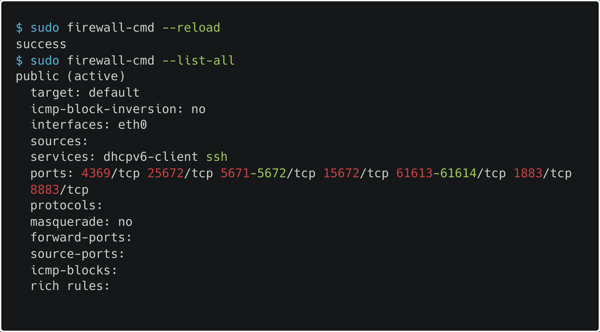**

Включаем **nis** (Network Information Service - распространяет карты имен, паролей и другую важную информацию компьютерам своего домена) в **SELinux**. Совершенно без понятия зачем, видимо как-то связано с работой **Erlang**, если это не сделать, то порт для **RabbitMQ** не выделится.

После чего пробуем различные фиксы из интернета (около 6), обращаемся к гадалке, от отчаяния пробуем оригинальный гайд по установке с официального сайта, и в конце концов понимаем, что ничего не работает. **RabbitMQ** мучает людей…

3.3. Итак вот оно — описание установки при помощи другого руководства. Первым делом меняем **hostname**, потому что **RabbitMQ** может не запустится, если hostname поменяется в будущем.

3.4. Далее как по [**старым гайдам**](#bookmark=id.gjdgxs) устанавливаем **wget** и **epel-release**.

3.5. Потом как по [**старым гайдам**](#bookmark=id.30j0zll) устанавливаем **Erlang**, но на этот раз без **socat** и **logrotate** (видимо не так они и нужны), а также понимаем, что в прошлый раз скачали старую версию (**erlang-solutions-1.0-**1), из-за чего могли и возникнуть трудности.

3.6. На этом шаге уже существенные отличия, а именно нужно создать и заполнить файл **/etc/yum.repos.d/rabbitmq.repo** (конфигурация репозитория), возможно в старых гайдах это производилось автоматически. **Nano** на **Centos** не предустановлено так что пользуемся **vi**.

Обновляем кэш репозиториев yum и уже можно наблюдать как все красиво:

3.7. Момент истины, загружаем **rabbitmq-server** и запускаем его. Загрузилось нормально ухх, включалось долго (чуть инфаркт не схватил), и….. (драматическая пауза) да Высшие Силы сжалились надо мной и все запустилось, ни фаерволл ни **SELinux** настраивать (пока) не пришлось.

Если что вот так выглядело описание установки из книги (если вы сюда телепортировались, то сначала телепортируйтесь [**сюда**](#bookmark=id.2et92p0)):

3.8. Постоянная рубрика «Удобные команды» на этот раз **RabbitMQ** (правда они вряд ли понадобятся, напрямую с **RabbitMQ** работает только **Openstack**, а нет понадобятся для настройки пользователя):

-   **rabbitmqctl delete_user user** — удалить пользователя
-   **rabbitmqctl change_password user strongpassword** — сменить пароль пользователя
-   **rabbitmqctl add_vhost /my_vhost** — добавить [**virtualhost**](http://virtualhost/)
-   **rabbitmqctl list_vhosts** — список virtualhosts
-   **rabbitmqctl delete_vhost /my_vhost** — удалить virtualhost
-   **rabbitmqctl set_permissions -p /my_vhost user ".\*" ".\*" ".\*"** - дать разрешение пользователю внутри virtualhost
-   **rabbitmqctl list_permissions -p /my_vhost** — список разрешений внутри virtualhost
-   **rabbitmqctl list_user_permissions user** — список всех разрешений пользователя
-   **rabbitmqctl clear_permissions -p /my_vhost user** — удалить разрешение пользователя внутри virtualhost
-   **rabbitmqctl status** — статус сервиса rabbitmq-server
-   **rabbitmqctl create_uers user strongpassword** — создать пользователя
-   **rabbitmqctl list_users** — список пользователей
-   **rabbitmqctl set_user_tags user tag** — присвоит тэг пользователю

3.9. Оказывается я пропустил некоторые настройки из начала книги, а именно обновление всех установленных пакетов:

Отключение network manager и редактирование файла **ifcfg-eth0** (поправить параметры **NM_CONTROLLED** и **ONBOOT**, а также проверить настройку ip-адреса и тд) в папке **/etc/sysconfig/network-scripts/**, так как **NetworkManager** будет мешать работе **Openstack** **Neutron**, судя по [**документации RedHat**](https://access.redhat.com/documentation/en-us/red_hat_openstack_platform/10/html/manual_installation_procedures/chap-prerequisites):

Отключение фаервола, а я то мучался ([**firewalld не используется даже когда хочется**](https://access.redhat.com/documentation/en-us/red_hat_openstack_platform/10/html/manual_installation_procedures/chap-prerequisites), вместо него используется **iptables**, будем их настраивать во время работы с сервисом **Neutron**):

Установка пакета **openstack-selinux** (**sudo** **yum -y install openstack-selinux**) или отключение **SELinux** (я решил отключить (изменить поле **SELINUX** в файле **/etc/sysconfig/selinux**, потом перезагрузиться), так как не особо разбираюсь в данной технологии, но может быть изучу, года наконец разверну кластер):

Проверка после перезагрузки:

Установка **chrony**, как на хосте, у меня он уже был предустановлен и настроен (вроде бы устанавливал только на хост машину):

Установка [**crudini**](http://www.pixelbeat.org/programs/crudini/) для редактирования конфигурационных файлов:

Пример команды для редактирования конфига (не буду же я одну команду выносить в рубрику):

НО это все равно не меняет того, что способ установки **RabbitMQ** представленный в книге неполный, хотя и была показана установка репозитория **epel-release** (выполните две команды ниже и [**назад**](#bookmark=id.3znysh7)).

3.10. Ну теперь можно заняться настройкой **RabbitMQ**. Для начала настроим аутентификацию, в руководствах говорится что есть два способа аутентификации: с использованием имени и пароля **SASL-аутентификации** (Simple Authentication and Security Layer), обеспечиваемой фреймворком **Erlang**, и при помощи сертификатов и SSL. Я решил (посмотрел в руководствах), что буду реализовывать первый способ + все сервисы будут работать под одним пользователем **RabbitMQ** (да я знаю, что так не очень безопасно, но я и фаерволл уже вырубил). Что касается **SASL-аутентификации** в **RabbitMQ**, то есть два метода: [**PLAIN**](https://www.rabbitmq.com/access-control.html#:~:text=Description-,PLAIN,-SASL%20PLAIN%20authentication) и [**AMQPLAIN**](https://www.rabbitmq.com/access-control.html#:~:text=most%20other%20clients.-,AMQPLAIN,-Non-standard%20version) и дефолтный пользователь **guest**.

Создаем пользователя **openstack** (пароль - **openstack**) для настройки сервисов **Openstack** и добавляем ему права на настройку, чтение и запись:

Для дальнейшего удобства активируем графическую консоль **RabbitMQ**, она будет работать на порту **15672**:

Для того чтобы получить доступ к в браузере обращаемся к **192.168.122.200:15672** (к моему большому удивлению проброс портов осуществлять не надо было). Для регистрации необходимо присвоить один из тэгов (**management**, **policymaker**, **monitoring**, **administrator**) созданному пользователю openstack, так как за пользователя guest зайти будет нельзя, из-за того что он может коннектиться [**только через loopback интерфейс**](https://www.rabbitmq.com/access-control.html#:~:text=). Я пока не знаю какой тег больше подойдет для пользователя **openstack**, когда узнаю нужный подчеркну выше (в этот web-интерфейс я больше ни разу не зашел). А пока по-быстрому создал пользователя **test** для проверки работоспособности web-интерфейса.

Все нормально работает, главное выставить тэг:

4\. Установка и настройка БД MariaDB и PyMySQL.

4.1. Итак мы наконец закончили с конфигурацией **RabbitMQ**, теперь можно приступить к конфигурирования БД для использования сервисами **Openstack**. Качаем **MariaDB** и клиентскую библиотеку **PyMySQL** с помощью одной команды!

4.2. Создаем файл **/etc/my.cnf.d/openstack.cnf** с конфигом **mysqld** и запускаем **MariaDB**:

-   [**bind-address**](https://dev.mysql.com/doc/refman/8.0/en/server-system-variables.html#sysvar_bind_address:~:text=%D0%B2%20MySQL%C2%BB%20.-,bind_address,-%D0%A4%D0%BE%D1%80%D0%BC%D0%B0%D1%82%20%D0%BA%D0%BE%D0%BC%D0%B0%D0%BD%D0%B4%D0%BD%D0%BE%D0%B9%20%D1%81%D1%82%D1%80%D0%BE%D0%BA%D0%B8) = **192.168.122.200** — ip-адрес контроллера БД
-   [**default-storage-engine**](https://dev.mysql.com/doc/refman/8.0/en/server-system-variables.html#sysvar_bind_address:~:text=%D0%A3%D0%BF%D1%80%D0%B0%D0%B2%D0%BB%D0%B5%D0%BD%D0%B8%D0%B5%20%D0%BF%D0%B0%D1%80%D0%BE%D0%BB%D1%8F%D0%BC%D0%B8%C2%BB%20.-,default_storage_engine,-%D0%A4%D0%BE%D1%80%D0%BC%D0%B0%D1%82%20%D0%BA%D0%BE%D0%BC%D0%B0%D0%BD%D0%B4%D0%BD%D0%BE%D0%B9%20%D1%81%D1%82%D1%80%D0%BE%D0%BA%D0%B8) = **innodb** - механизм хранения для таблиц по умолчанию, в данном случае [**innodb**](https://animatika.ru/info/gloss/innodb.html) (данные хранятся в больших совместно используемых файлах).
-   [**innodb_file_per_table**](https://dev.mysql.com/doc/refman/8.0/en/innodb-parameters.html#sysvar_innodb_file_per_table:~:text=WITH_DEBUG%20CMake%20option.-,innodb_file_per_table,-Command-Line%20Format) = **on** — для каждой таблицы будет создаваться новый файл
-   [**max_connections**](http://max_connections/) = **4096** — максимальное количество подключений
-   [**collation-server**](https://dev.mysql.com/doc/refman/8.0/en/server-system-variables.html#sysvar_collation_server:~:text=the%20default%20database.-,collation_server,-Command-Line%20Format) = **utf8_general_ci** — тип сервера сравнения и сортировки строк, [**utf8_general_ci**](https://webcache.googleusercontent.com/search?q=cache:5FVk_T2r3uoJ:https://dev.mysql.com/doc/refman/8.0/en/charset-unicode-sets.html&cd=2&hl=ru&ct=clnk&gl=ru#:~:text=%C3%9C%20%3D%20Y%20%3C%20%C3%96-,_general_ci%20Versus%20_unicode_ci%20Collations,-For%20any%20Unicode) — дефолт для **utf8**.
-   [**character-set-server**](https://dev.mysql.com/doc/refman/8.0/en/server-system-variables.html#sysvar_collation_server:~:text=and%20error%20messages.-,character_set_server,-Command-Line%20Format) = **utf8** — тип набора символов на сервере

4.3. Запускаем супер-пупер мега скрипт [**mysql_secure_installation**](https://mariadb.com/kb/en/mysql_secure_installation/), который поможет безопасно установить **MariaDB** (что в принципе видно из названия), во время скрипта можно:

-   Установить пароль для учетных записей **root**.
-   Удалить корневые учетные записи, доступные из-за пределов локального хоста.
-   Удалить учетные записи анонимных пользователей.
-   Удалить тестовую базу данных, к которой по умолчанию могут обращаться анонимные пользователи.

Я везде отвечал **yes** (возможно это была критическая ошибка (нет)).

Проверить работу сервиса можно так:

5\. Установка и настройка сервиса идентификации Keystone

5.1. Теперь можно и потихоньку начать настраивать сервисы **Openstack**, все начинается в **Keystone**. Что такое **Keystone** — это сервис идентификации **Openstack**, представляет собой централизованный каталог пользователей и сервисов, к которым они имеют доступ. Если хотите еще одно синонимичное описание то вот: **Keystone** - единая система аутентификации и авторизации облачной операционной системы.Сервис поддерживает следующие типы аутентификации:

-   Аутентификация по токенам
-   Аутентификация при помощи пары имя пользователя/пароль
-   **AWS**-совместимая аутентификация (Amazon Web Services)

Также **Keystone** хранит в себе список всех доступных сервисов в **Openstack** и реквизитов для обращения к их API (без привязки к пользователю), из чего следует, что и поднимать его нужно первым, ведь потом каждый последующий сервис надо в нем регистрировать.

Что такое **Сервис**, **Пользователь** и **Токен** и так понятно, а вот **Проект** что-то новое — это объединение **Ресурсов** (виртуальные машины, образы и т. д.), придуман чтобы контролировать права пользователей, чтобы они могли видеть и работать с ВМ только внутри одного проекта (изначально думал, что это типо **Namespace**, но есть еще **Домен**). Также в **Openstack** как и в **Kubernetes** **Пользователи** напрямую не имеют доступ к **Ресурсам** **Проектов**, а получают его через так называемые **Роли** (понятно для чего так придумано, чтоб можно было создавать кастомные права доступа и быстро их назначать пользователям). Думали все, а нет, еще есть **Домены** — объединения **Проектов**, уже полные аналоги **Namespace**. Ладно по теории вроде бы все теперь качаем.

5.2. Качаем пакеты **openstack-keystone** (сам **Keystone**) [**python-openstack-client**](https://github.com/openstack/python-openstackclient) (удобный CLI для работы с **Openstack**) [**httpd**](https://httpd.apache.org/) (**http** сервер **Apache**) [**mod_wsgi**](https://modwsgi.readthedocs.io/en/master/) (модуль **http** сервера для связи сервера и программой на **python**) с помощью **yum**. **Проблема** подкралась незаметно — пакеты **openstack-keystone** и pythonopenstackclient **не скачались**, но хоть фиксится просто во первых в файле **/etc/yum.repos.d/epel.repo** дизейблим все репозитории (**enabled=0**), а во-вторых я дефис забыл в названии пакета **python-openstackclient**.

5.3. Как уже говорилось, для каждого сервиса **Openstack** необходима отдельная БД, которую надо создавать руками, если происходит установка каждого сервера отдельно, так что создаем **keystone** БД, также надо выдать привилегии, чтобы сервис мог нормально работать с БД.

5.4. В конфиг **Keystone** (**/etc/keystone/keystone.conf**) пишем путь к БД, можно с помощью **crudini**, можно с **vi** и тд.

5.5. Задаем формат и провайдер токенов генерируемых сервисом **Keystone**. Формат токенов на выбор:

-   **UUID** - строка из 32 символов, которую удобно использовать в вызовах **OpenStack** API, например применяя команду **curl**. Круто - небольшой размер, не круто – токен не содержит информации, достаточной для того, чтобы произвести локальную авторизацию (сервисы **OpenStack** каждый раз должны отправлять токен сервису **Keystone**, для того чтобы получить информацию, какие операции разрешены с этим токеном).
-   **PKI** - содержат всю необходимую для локальной авторизации информацию и, кроме того, содержат в себе цифровую подпись и информацию об устаревании, а значит сервисы **OpenStack** могут локально кэшировать эти токены. Круто — нет теперь дудоса токенами, не круто — токены большие (могут быть больше 8 Кб), и некоторые сервисы не поддерживают HTTP-заголовки такого размера, и еще как с **curl** работать, когда у тебя заголовок на 8 Кб.
-   **PKIz** — пытались пофиксить проблемы **PKI**, но ничего не вышло, и они ушли в небытие.
-   **Fernet** - небольшого размера (до 255 символов), но содержат достаточно информации для локальной авторизации. Их не требуется синхронизировать между регионами, для них не нужна база данных (токены без сохранения состояния), и процесс генерации их быстрее, чем в первых двух реализациях. Дополнительным плюсом будет отсутствие необходимости настройки memcached (можно не кешировать, но по итогу все равно надо, если хочешь быть крутым). **Их и используем.**

Выставляем провайдера токенов в файле **/etc/keystone/keystone.conf** сами знаете как.

5.6. Инициализируем базу данных (скрипт **keystone-manage db_sync**) репозитории ключей **Fernet** (2 команды - **«keystone-manage** **fernet_setup»** и **«keystone-manage credential_setup»**).

5.7. Конфигурируем доменное имя сервера **Apache** **httpd** - сервис идентификации для сетевого взаимодействия, путем редактирования файла **/etc/httpd/conf/httpd.conf** (без использования **cruduini**).

Также создаем и редактируем файл **/etc/httpd/conf.d/wsgi-keystone.conf** (это конфигурация модуля **http-сервера** для связи сервера и программой на **python**).

Ну чтож вот [**оп**](https://www.opennet.ru/docs/RUS/apache_dir/#Location)**исание полей**:

-   **Listen** — на каком порту работает
-   **VirtualHost** — имя **virtualhost** (любое на таком-то порту)
-   **WSGIDaemonProcess** — создать отдельные процессы демона, которым будет делегирован запуск приложений WSGI.
-   **WSGIProcessGroup** — в какой группе процессов будет выполняться приложение WSGI.
-   **WSGIScriptAlias** — помечает каталог как содержащий сценарии WSGI
-   **WSGIApplicationGroup** — какой группе приложений принадлежит приложение WSGI.
-   **WSGIPassAuthorization** - передаются ли заголовки авторизации HTTP в приложение WSGI.
-   **LimitRequestBody** - максимальное количество байт, которое может быть в запросе.
-   **IfVersion** — если версия **Apache** больше/меньше
-   **ErrorLogFormat** — формат лога ошибки
-   **ErrorLog** — файл сохранения логов
-   **CustomLog** — файл сохранения логов доп хоста
-   **Directory** — местонахождение проекта
-   **Require** **all** **granted** — нет IP-адресов, заблокированных для доступа к сервису (новая версия)
-   **Order** **allow,deny** — [**настройка**](https://habr.com/ru/post/81858/) системы контроля доступа
-   **Allow from all** — нет IP-адресов, заблокированных для доступа к сервису (старая версия)
-   **Alias** — сопоставление URL-адреса с путем файловой системы
-   **Location** — внутри настройки управления доступа к URL
-   **SetHandler** — просмотр определенного хендлера
-   **Options** — разрешенные особенности сервера

Наконец-то запускаем веб-сервер:

5.8. Теперь инициализируем **Keystone**. Опять же есть два варианта инициализации:

-   Использовать команду **«keystone-manage** **bootstrap»**, которая выполнит инициализацию за нас (рекомендовано разработчиками, после того как попробовал второй способ использовал этот):

Данная команда создаст за нас записи о сервисе Keystone, точки входа (**admin**, **internal** и **public**) в сервис Keystone и регион в котором расположен сервис Keystone, а также **default** домен, проект **admin**, пользователь **admin** и роль **admin** и соединить их:

Измененный скрипт (создаем сами, **PS1** — для красивого названия в консоли):

Созданные ресурсы:

****

-   Воспользоваться авторизационным токеном (общий секрет между **Keystone** и другими сервисами, а также вход в админку без пароля), долго, но зато идеально для понимания процессов (мой выбор, который был изменен на первый способ, так как этот способ был [**вырезан**](https://docs.openstack.org/keystone/rocky/admin/identity-auth-token-middleware.html#:~:text=The%20admin_token%20option%20is%20deprecated%20and%20no%20longer%20used%20for%20configuring%20auth_token%20middleware.)):

Для начала надо сгенерировать токен с помощью **OpenSSL** и поместить его в файл конфига **Keystone**:

Немножко займемся оптимизацией и напишем скрипт для задания значений переменным окружения (**OS_TOCKEN** — наш токен, **OS_URL** — URL **Keystone**, **OS_IDENTITY_API_VERSION** — версия API **Keystone**)

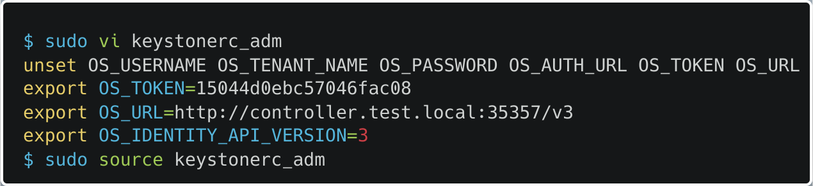

После попытки отправки запроса на сервер, было получено много различных ошибок.

5.9. После того как помучились с инициализацией создадим непривилегированного пользователя и все что для него надо (admin пользователь был создан автоматически).

Создаем проект **demo**:

Создаем пользователя **demo** с собственным **email**:

Создаем роль **user**:

Добавляем роль **user** в проекте **demo** пользователю **demo**:

Скрипт для входа за пользователя **demo** (**keystonerc_usr**):

5.10. Создаем проект **service** для всех сервисов **Openstack**:

С **Keystone** пока закончили, теперь можно перечислить полезные команды **openstack cli** (сюда будут добавляться все команды использованные в процессе конфигурирования кластера):

-   **openstack user list** — список пользователей
-   **openstack role list** — список ролей
-   **openstack role assignment list** — список назначения ролей
-   **openstack domain list** — список доменов
-   **openstack volume list** — список томов
-   **openstack stack list** — список стеков
-   **openstack stack event list имя_стека** — список событий при создании стека
-   **openstack stack resource list имя_стека** — список ресурсов стека
-   **openstack volume backup list** — список бэкапов томов
-   **openstack server add volume имя_ВМ имя_тома** — подключение тома к ВМ
-   **openstack server remove volume имя_ВМ имя_тома** — отключение тома от ВМ
-   **openstack service list** — список сервисов
-   **openstack server list** — список ВМ
-   **openstack metric resource-type list** — список типов ресурсов метрик
-   **openstack metric resource list** — список ресурсов метрик
-   **openstack metric resource show имя** — список метрик связанных с ресурсом
-   **openstack metric measures show --resource-id id_ресурса имя_метрики** — список значений определенной метрики ресурса
-   **openstack alarm list** — список триггеров
-   **openstack orchestration service list** — список сервисов оркестрации
-   **openstack backup list** — список резервных копий
-   **openstack volume type list** — список типов томов (зашифрованный или нет)
-   **openstack security group list** — список групп безопасности
-   **openstack aggregate list** — список агрегаторов узлов
-   **openstack availability zone list** — список зон доступности
-   **openstack security group rule list имя_группы —** список правил брандмауэра для группы безопасности
-   **openstack security group rule create --protocol протокол --dst-port номер_порта имя_группы** — добавление правила брандмауэра в группу безопасности
-   **openstack hypervisor list** — список гипервизоров
-   **openstack hypervisor stats show** — статистика по гипервизорам
-   **openstack usage list** — использование ресурсов объектами
-   **openstack project list** — список проектов
-   **openstack quota list** — список квот на ресурсы
-   **openstack catalog list** — список каталогов
-   **openstack network agent list** — список сетевых агентов (dhcp, open vswitch и тд)
-   **openstack compute service list** — список служб Nova
-   **openstack host list** — список узлов
-   **openstack floating ip list** — список плавающих ip
-   **openstack floating ip create имя_сети** — создание плавающего ip из сети
-   **openstack server add floating ip имя_ВМ ip_адрес** — присоединение плавающего Ip к ВМ
-   **openstack hypervisor show имя_узла** — информация о гипервизоре узла
-   **openstack endpoint list** — список конечных точек
-   **openstack image list** — список образов
-   **openstack image save имя_образа \> путь_куда_сохранять** — скачать образ на локальную машину
-   **openstack image create имя_ВМ имя_образа** — создать образ из ВМ в Openstack
-   **openstack volume snapshot create --volume имя_тома** **имя_снимка** — создать снимок тома
-   **openstack volume backup create имя_тома** — создать бэкап тома
-   **openstack volume backup restore id_бэкапа имя_тома —** откатить том к бэкапу
-   **openstack console url show имя_вм** — показать URL по которому можно подключится к ВМ через noVNC
-   **openstack тип show имя_объекта** — информация о конкретном объекте
-   **openstack тип delete имя_объекта** — удаление объекта
-   **openstack service create --name имя_сервиса —description "описание" тип_сервиса** — создание сервиса
-   **openstack endpoint create тип_точки тип_интерфейса url --region регион** — создание конечной точки
-   **openstack domain create --description "описание" имя_домена** — создание домена
-   **openstack project create --domain имя_домена --description "описание" имя_проекта** — создание проекта
-   **openstack user create --domain имя_домена --email почта_пользователя --password пароль_пользователя имя_пользователя** — создание пользователя
-   **openstack role create имя_роли** — создание роли
-   **openstack role add --project имя_проект --user имя_пользователя имя_роли** — создание назначения роли (привязка роли к пользователю)
-   **openstack тип set --имя_поля значение_поля имя_объекта** — изменение полей объекта
-   **openstack тип unset --имя_поля значение_поля имя_объекта** — удаление поля объекта
-   **openstack console log show имя_ВМ** — показать логи ВМ
-   **openstack --debug** — полезный флаг для просмотра вызовов к Openstack API
-   **openstack token issue** — запрос токена для аутентификации
-   **openstack keypair create имя_пары \> файл_сохранения_пары** — создание пары ssh ключей
-   **source keystonerc_adm** — запуск скриптов (в моем случае задача глобальный переменных для авторизации под ролью **admin**)
-   **env** — просмотр переменных окружения
-   **/etc/имя_сервиса/имя_сервиса(или)службы.conf** — файлы конфигов
-   **/var/log/имя_сервиса/имя_сервиса-имя_службы.log** — файлы логов (некоторые тут **/var/log/httpd/\***)

6\. Установка и настройка сервиса хранения образов Glance

Перед началом хочется отметить, что обращения к **Openstack** API начали проходить достаточно медленно, после перезагрузки машины, возможно я дал ВМ слишком мало системных ресурсов, а может так и должно быть, вобщем пугаться долгих ответов сервера не надо, ниче не умерло.

6.1. Что ж для чего нам нужен **Glance**? **Glance** - ведет каталог, регистрация рует и доставляет образы виртуальных машин (как известно образ представляет собой шаблон для ВМ, может быть просто ОС, а может и содержать предустановленные пакеты). НО **Glance** самостоятельно не хранит образы, а использует для этого систему хранения данных (**Swift**, **Ceph** или просто **локальн**о на узле), информация же о размере, формате, имени образа и т. д. хранится в БД. Поддерживаются следующие форматы образов, еще есть образы контейнеров, но это уже другая история:

-   **vhd** (Virtual Hard Disk) — виртуальный жесткий диск от Microsoft
-   **vmdk** (Virtual Machine Disk) — диск виртуальной машины от VMware
-   **vdi** (Virtual Disk Image) — образ виртуального диска от VirtualBox(Oracle)
-   **iso** (International Organization for Standardization) — образ оптического диска от International Organization for Standardization
-   **qcow2** (QEMU Copy On Write 2) — образ QEMU
-   **ami** — образ Amazon Machine
-   **ari** — образ Amazon Ramdisk
-   **aki** — образ Amazon Kernel
-   **vhdx** — улучшенная версия vhd
-   **raw** — диск неструктурированного формата RAW

Стоит отметить, что данный сервис состоит из двух служб:

-   **glance-api** – предоставляет доступ к REST API сервиса образов для поиска, хранения и получения образов;
-   **glance-registry** – хранит, обрабатывает и предоставляет информацию. Непосредственно пользователи не взаимодействуют с этим сервисом, только сервисы **Glance**.

Вот красивая картинка компонентов **Glance**:

Что происходит когда мы отправляем запрос на создание ВМ — **Nova** (еще не созданный сервис по управлению виртуальными машинами и сетью) отправляет GET-запрос по адресу **http://путь-к-сервису-glance/images/идентификатор-образа**. В случае если образ найден, то glance-api возвращает URL, ссылающийся на образ. **Nova** передает ссылку драйверу гипервизора, который напрямую скачивает образ и запускает ВМ.

6.2. Теперь начинается практика, первым делом добавляем все необходимые компоненты в наш **Keystone**:

Создаем пользователя **glance**:

Присваиваем пользователю **glance** роль **admin** в проекте **serivce**:

Создаем сервис **glance**:

Создадим точки входа для сервиса **glance**:

6.3. Теперь устанавливаем сервис **Glance** с помощью **yum**:

6.4. Создаем БД **glance** и выдаем на нее права:

6.5. Прописываем строку подключения к базе данных в файлах конфигов служб **glance-api** (**/etc/glance/glance-api.conf**) и **glance-registry** (**/etc/glance/glance-registry.conf**):

6.6. Завершаем настройку БД **glance** с помощью скрипта (**db_sync**):

6.7. Все что касается БД **glance** настроено, теперь настроим сам службу **glance-api** через конфиг (**/etc/glance/glance-api.conf**):

Настраиваем тип сервис аутентификации:

Настраиваем разрешенный ip отправителя запросов к сервису **Glance**:

Настраиваем URL аутентификации:

Настраиваем тип авторизации:

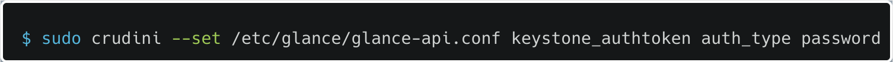

Настраиваем имя домена в котором находится проект **glance**:

Настраиваем имя домена в котором находится пользователь **glance**:

Настраиваем имя проекта в котором находится пользователь **glance**:

Настраиваем имя пользователя:

Настраиваем пароль пользователя **glance**:

Настраиваем тип хранения образов (локальная файловая система):

Настраиваем путь к папке, гдк будут хранится образы:

Также стоит отметить, что можно добавить несколько хранилищ образов с приоритетом (больше цифра - больше приоритет сохранения образа) по использованию, но я так не делал:

Поля файла **/etc/glance/glance-api.conf** после исполнения команд (легко найти через **vi**, потом /текст, который надо найти):

6.8. Теперь настроим сам службу **glance-registry** через конфиг (**/etc/glance/glance-registry.conf**), те же самые названия полей, кроме секции **glance_store**:

6.9. Настраиваем параметры подключения к сервису **RabbitMQ** для службы glance-api (**/etc/glance/glance-api.conf**):

Настраиваем пароль пользователя **RabbitMQ**:

Настраиваем имя пользователя **RabbitMQ**:

Настраиваем имя хоста **RabbitMQ**:

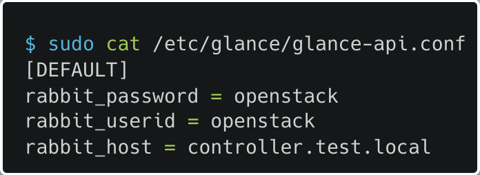

6.10. Запускаем сконфигурированные службы **glance-api** и **glance-registry**:

Папку для хранения образов нужно создать, а то **glance-api** не запустится (словил прикол, что у **glance-api** не было разрешений на файл, в котором хранятся логи - **/var/log/glance/api.log**). Решение прикола с разрешениями:

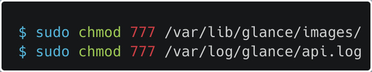

6.11. Итак мы все настроили и запустили, теперь можно затестить

Для начала скачаем образ **CirrOS** – минималистская операционная система с помощью **wget**:

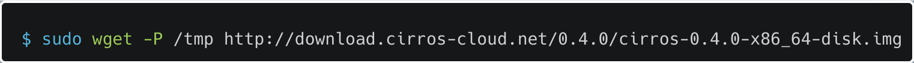

Необходимо также установить **qemu-img**, а потом посмотреть информацию о скачанном образе:

Какую информацию qemu-img:

-   **file format** – формат диска
-   **virtual size** – размер диска виртуальной машины
-   **disk size** – действительный размер файла
-   **cluster_size** – размер блока (кластера) qcow
-   **format specific information** – специфичная для формата информация (**compat** — версия QEMU, l**azy refcounts** — если on, то отключен ввод вывод метаданных, **refcount bits** — размер refcount table (но я не уверен), **corrupt** — искаженные данные или нет)

Далее надо скачать какую-нибудь утилиту автоматизированного создания образов, я выбрал **Oz**, которая использует заранее подготовленные файлы ответов неинтерактивной установки операционной системы. Если во время установки Keystone, были ошибки как и у меня и поэтому пришлось отключить epel repo, то его (и только его) надо опять [**включить**](#bookmark=id.tyjcwt).

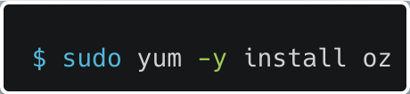

Проверяем, что сеть libvirtd (перед этим **libvirtd** надо врубить), используемая по умолчанию с помощью команды **virsh net-list**, если нет, то определяем ее и задаем автозапуск сети:

Врубаем **libvirtd**:

У меня после запуска **libvirtd** дефолтная сеть задалась автоматически:

Если у вас команда **virsh net-list** вывела что-то другое, то выполните две команды **net-define** (инициализация сети) и **net-autostart** (автостарт сети):

6.12. Теперь, после того как скачали **oz** и настроили дефолтную сеть, можно начать настраивать **oz**.

Сначала зададим в качестве типа образа формат qcow2 в файле конфигурации **oz** (**/etc/oz/ oz.cfg**):

Теперь выбираем TDL шаблон для создания образа, примеры TDL шаблонов находятся в папке **/usr/share/doc/oz-0.15.0/examples**. Я списал самый простой TDL шаблон, а именно тот в котором определяются только путь к дистрибутиву (**\<install\>**) и пароль пользователя root (**\<rootpw\>**):

Полезные секции кроме **\<install\>** и **\<rootpw\>:**

-   **\<packages\>** - установка пакетов
-   **\<repositories\>** - добавление репозиториев
-   **\<files\>** - создание файлов
-   **\<commands\>** - выполнение команд

После создание TDL шаблона можно создать образ с помощью oz-install (**-t —** через сколько секунд инсталлятор должен прервать установку, **-d** — показывает уровень сообщений об ошибках (**2** — норм, **3** — подробно)). Создается очень долго:

Образ должен появится в папке /**var/lib/libvirt/images**, но он весит 11GB, так что я его так и не скачал (диск на виртуалке 11 GB), дальше если хотите подготовить образ к использованию в **Openstack** надо с помощью **virt-sysprep** (надо скачать) убрать специфичную для конкретного экземпляра машины информацию, потом уменьшить размер образа (превратить в тонкий диск) при помощи **virt-sparsify**. Если надо отредачить уже готовый образ то можно скачать **guestfish**:

6.13. Наконец-то после того как мы поработали с образами сами, можно поработать с образами с помощью **Openstack**. Для начала надо добавить в оба рабочих файла **keystonerc_adm** и **keystonerc_usr** переменную среды, определяющую версию **Glance** API, с которой мы будем работать (**OS_IMAGE_API_VERSION**=2):

Загружаем наш скачанный образ **Cirros** в **Glance**:

Используемые параметры:

**--file** — путь до файла с образом

**--disk-format** — формат образа диска

**--container-format** — формат контейнера (bare — не контейнер)

**--public** — образ доступен всем

Для вас с прошлой строчки прошла одна секунда, а для меня - два дня, так как команда на скрине не выполнялась из-за того, что **Glance** не мог авторизоваться в **Keystone** (я так думал), в результате оказалось, что **Glance** не мог отправить запрос на URL <http://controller.test.local:35357/v3/>, так как это доменное имя не было прописано в **/etc/hosts** (но ведь запросы к **Keystone** шли нормально!!!), чтобы все работало надо каждое имя узла добавлять в **/etc/hosts** (зато я поработал с файлами логов **keystone** и **glance**, а также флагом **--debug**):

После того как образ был загружен, он должен появится в этой папке **/var/lib/glance/images/**:

На этом все, но можно добавить, что образы популярных ОС можно найти тут:

-   Ubuntu: [**http://cloud-images.ubuntu.com/**](http://cloud-images.ubuntu.com/)
-   Fedora: [**https://cloud.fedoraproject.org/**](https://cloud.fedoraproject.org/)
-   Debian: [**http://cdimage.debian.org/cdimage/openstack/**](http://cdimage.debian.org/cdimage/openstack/)
-   CentOS: [**http://cloud.centos.org/centos/7/**](http://cloud.centos.org/centos/7/)

7\. Установка и настройка сервиса блочного хранилища Cinder

7.1. **Cinder** придуман для того чтобы хранить модифицированные в ходе работы тома, созданных образов, зачем? Ну, например, когда мы создали ВМ с помощью сервиса **Nova** (потом установим) мы с ней работаем (что-то устанавливаем, изменяем и тд), а что если узел на котором была создана ВМ выйдет из строя, и нам нужно ее срочно восстановить, **Glance** у нас хранит только базовые образы и никак не поможет, вот для из-за таких ситуаций и придуман **Cinder**, который записывает все изменения тома на узлах, где установлен **cinder-volume**. Также в **Cinder** можно не только хранить тома, но и создавать их снимки в режиме «только для чтения», с помощью которых создавать новые тома, доступные на запись.

Архитектура Cinder:

****

Службы Cinder:

-   **cinder-api** – точка входа для запросов в сервис по протоколу HTTP. Приняв запрос, сервис проверяет полномочия на выполнение запроса и переправляет запрос брокеру сообщений для доставки другим службам
-   **cinder-scheduler** – сервис-планировщик принимает запросы от брокера сообщений и определяет, какой узел с сервисом **openstack-cinder-volume** должен обработать запрос
-   **cinder-volume** – сервис отвечает за взаимодействие с бэкэндом – блочным устройством. Получает запросы от планировщика и транслирует непосредственно в хранилище. **Cinder** позволяет одновременно использовать несколько бэкендов. При этом для каждого из них запускается свой openstack-**cinder-volume**. И при помощи параметров **CapacityFilter** и **CapacityWeigher** можно управлять тем, какой бэкенд выберет планировщик
-   **cinder-backup** – сервис отвечает за создание резервных копий томов в объектное хранилище

7.2. К этому пункту свободное место на control узле равнялось 1GB, так что надо увеличивать размер:

Первым делом вырубаем **VM2** и увеличиваем размер диска **qcow2** на 3GB:

Потом запускаем **VM2**:

Теперь с помощью **lsblk** проверяем, что появился диск **/dev/vda2**, а с помощью **pvs**, что на нем стоит система:

Скорее всего увеличить размер партиции можно и другим способом, но я побоялся экспериментировать и скачал утилиту **growpart**:

После этого увеличиваем размер раздела **/dev/vda2**:

И наконец увеличиваем раздел **/dev/mapper/centos-root**:

7.3. Теперь можно начать настройку окружения для сервиса **Cinder**, для этого надо добавить к виртуальной машине еще один диск в качестве блочного устройства, созданного с помощью [**Linux LVM**](https://habr.com/ru/post/67283/) (использует протокол [**iSCSI**](https://community.fs.com/ru/blog/iscsi-storage-basics-plan-iscsi-san.html)), на который будут писаться все изменения томов ВМ параллельно их записи на локальную систему рабочего узла.

Создадим новый диск и прикрепим его к запущенной **VM2**:

В **VM2** проверяем присоединенный диск:

****

Теперь создаем **LVM-группу** на присоединенном диске:

7.3. Теперь качаем пакет openstack-cinder и редачим его конфигурационный файл **/etc/cinder/cinder.conf**.

Настраиваем подключение к БД:

Настраиваем URL, имя и пароль **RabbitMQ**:

Как раньше настраиваем реквизиты пользователя и проекта в **Keystone**:

Настройка имени **lvm-группы**:

Настраиваем бэкенд хранения **Cinder**, а также драйвер (отвечает за хранение данных при помощи локального менеджера логических томов и протокола транспорта iSCSI) для него:

Настраиваем используемый протокол транспорта и возможность использовать команду cinder-rtstool для управления томами (**lioadm** — поддержка [**LIO iSCSI**](https://habr.com/ru/post/200466/#:~:text=%D0%92%D1%81%D1%82%D1%80%D0%B5%D1%87%D0%B0%D0%B9%D1%82%D0%B5%2C%20%D0%B2%D0%BE%D1%82%20%D0%BE%D0%BD%D0%B8.-,LIO,-linux-iscsi.org)):

Настройка URL **Glance** API:

Настройка пути к папке, где будут хранится [**lock-файлы**](https://docs.openstack.org/oslo.concurrency/ussuri/admin/index.html) (файлы, создаваемые сервисами для межпроцессорной блокировки):

7.4. Теперь аналогично прошлым настройка создаем БД **cinder**:

Во время выполнения скрипта синхронизации вылезают сообщения об устаревших полях, полностью их игнорируем, БД и так поднимется:

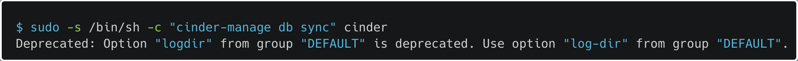

7.5. Теперь регистрируем сервис **Cinder** в **Keystone**:

Создаем пользователя **cinder** и предоставляем ему роль:

Создаем сервисы **cinderv2** и **cinderv3**. Раньше надо было иметь две версии **cinder** для полной совместимости с остальными сервисам, но вроде как это уже [**не необходимо**](https://docs.openstack.org/cinder/latest/install/cinder-controller-install-rdo.html#:~:text=Beginning%20with%20the%20Xena%20release) и можно ограничится только сервисом **cinderv3** (я боюсь и разверну 2 сервиса):

Соответственно раз сервиса два, то и точек входа в два раза больше:

7.6. Теперь устанавливаем и настраиваем сервис **iSCSI**, по идее следующие действия надо производить на других узлах для большей доступности и отказоустойчивости, поэтому некоторые команды могут повторяться.

Устанавливаем [**targetcli**](https://www.saqwel.ru/articles/linux/nastrojka-linux-iscsi-posredstvom-targetcli/) (оболочка для управления **LIO iSCSI**):

Задаем ip машины на которой будет находится **cinder-volume**:

Задаем бэкенд хранения **Cinder**:

По итогу всех махинаций наш конфиг (**/etc/cinder/cinder.conf**) выглядит так:

7.7. Теперь запускаем все что можно:

Также все эти службы можно было запустить одной командой с помощью пакета [**openstack-utils**](https://github.com/redhat-openstack/openstack-utils), который надо скачать, так как с помощью него также можно удобно селдить за статусами всех сервисов кластера:

Запуск всех служб **Cinder** одной командой:

Просмотр статуса всех сервисов одной командой (если что **keystone** и должен быть в **inactive**, мы ведь его напрямую не поднимали, а через **RabbitMQ**):

Также можно посмотреть состояние служб **Cinder** (**cinder-backup** по идее должен был быть остановлен, так как ему не задана конечная точка бэкенда хранения этих самых бэкапов (то самый сервис **Swift** из будущего), он почему-то работает, но в логах пишет, что могут быть проблемы):

Содержимое файла логов **/var/log/cinder/backup.log** **cinder-backup**:

На этом настройка закончена, теперь тестим функционал. Для этого попробуем создать том (**volume**) **testvol1**:

Пока с помощью **openstack cli** посмотреть на созданный том (**openstack volume list**) нельзя, так как мы еще не развернули сервис nova, но можно посмотреть с помощью **cinder cli**:

Зря я сделал диск размером всего в 2GB:

7.8. По идее на этом можно закнчивать настройку сервиса **Cinder**, но надо кое-что уточнить, а именно, что в реальной жизни бэкендом **cinder-volume** и cinder-backup должен быть сервис **Swift** или **Ceph**, которые нужно разворачивать на других узлах. Мой ноут с 8GB оперативки и в перспективе двумя рабочими узлами такое точно не потянет, но все-таки было принято решение сделать бэкендом **cinder-backup NFS-сервер** расположенный на одном из рабочих узлов в качестве эксперимента.

Итак для начала нужно этот рабочий узел поднять (когда я в первом пункте сказал, что поднял 3 ВМ, я соврал):

Теперь наконец-то понятная настройка ВМ для работы с **Openstack** (если что файл **/etc/hosts** должен выглядеть да всех ВМ одинаково, так что редачим его на каждой ВМ):

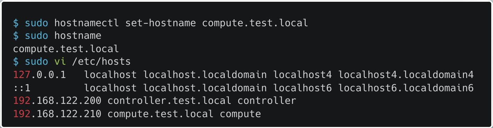

Теперь настраиваем все что касается [**nfs сервера**](https://winitpro.ru/index.php/2020/06/05/ustanovka-nastrojka-nfs-servera-i-klienta-linux/):

Скачиваем и запускаем **nfs-server**:

Создаем папку в которая будет общая для всех **nfs-клиентов**;

Редактируем файл **/etc/exports**, указывая каким ip-адресам будет доступна папка, после чего применяем настройка и перезапускаем **nfs-сервер**:

-   **rw** – права на запись в каталоге (**ro** – доступ только на чтение)
-   **sync** – синхронный режим доступа (**async** – подразумевает, что не нужно ждать подтверждения записи на диск)
-   **no_root_squash** – разрешает root пользователю с клиента получать доступ к NFS каталогу (обычно не рекомендуется)
-   **no_all_squash** — включение авторизации пользователя (**all_squash** – доступ к ресурсам от анонимного пользователя)

Теперь попробуем настроить **NFS** бэкенд для **cinder-backup** на **controllet.test.local** (оказалось, что не обязательно настраивать **nfs-клиента** самостоятельно, монтировать папки и тд, достаточно просто добавить параметры в конфиг **Cinder** **/etc/cinder/cinder.conf**, и все cмонтируется автоматически после перезагрузки сервиса **Cinder**):

Настраиваем драйвер для **cinder-backup** и папку **nfs-сервера**, которую надо смонтировать:

Все, поздравляю **Swift** можно не настраивать как и **Ceph**, но сами понимаете, что если мощность позволяют надо обязательно ставить или **Swift** или **Ceph**, желательно на трех отдельных узлах. Пока нет желания про них что-то расписывать, может только в самом конце, когда все будет настроено, я разверну **Swift** или **Ceph** на рабочих узлах.

8\. Установка и настройка сервиса управления виртуальными машинами и сетью Nova

8.1. Сервис **Nova** у нас отвечает за за управление запущенными экземплярами виртуальных машин, а также сетью (раньше да, теперь за сеть отвечает **Neutron**) как видно из названия раздела. Состоит из следующих служб (помимо **RabbitMQ** (брокера сообщений) и собственной БД):

-   **openstack-nova-api** – как и подобные службы других рассмотренных сервисов, отвечает за обработку пользовательских вызовов API.
-   **openstack-nova-scheduler** – сервис-планировщик. Получает из очереди запросы на запуск виртуальных машин и выбирает узел для их запуска. Выбор осуществляется, согласно весам узлов после применения фильтров (необходимый объем оперативной памяти, определенная зона доступности и т. д.). Вес рассчитывается каждый раз при запуске или миграции виртуальной машины.
-   **openstack-nova-conductor** – служба выступает в качестве посредника между базой данных и nova-compute, позволяя осуществлять горизонтальное масштабирование (нельзя развертывать на тех же узлах, что и nova-compute).
-   **openstack-nova-novncproxy** – выступает в роли [**VNCпрокси**](https://habr.com/ru/post/76237/) (такую опцию можно было выбрать во время запуска виртуалок при помощи **virsh**) и позволяет подключаться к консоли виртуальных машин при помощи браузера.
-   **openstack-nova-consoleauth** – отвечает за авторизацию для сервиса **openstack-nova-novncproxy** (вроде как больше не поддерживается).
-   **openstack-nova-placement-api** – сервис отвечает за отслеживание списка ресурсов и их использование (раньше был частью nova, потом отпочковался и стал назваться **openstack-placement-api**, а по-благородному **Placement**).
-   **openstack-nova-compute** – демон, управляющий виртуальными машинами через API гипервизора. Как правило, запускается на узлах, где располагается сам гипервизор.

Все сервисы кроме **nova-compute** располагаются на **controller** узле, а **nova-compute** на рабочих узлах **compute** и **compute-opt** (пока не создан).

8.2. Приступаем к установке сервиса **Nova**:

Как всегда базовые начальные шаги (и хорошо, что они у всех сервисов очень похожие):

Устанавливаем все службы **Nova**, кроме **openstack-nova-compute** (Placement раз уж он был когда-то частью **Nova** тоже скачаем и потом настроим, также возможно не надо качать **openstack-nova-console**, так как **openstack-nova-consoleauth** больше не поддерживается, но это не точно):

Создаем три бд (**nova** — содержит всю информацию о ВМ, которые удалось запланировать, **nova-api** — содержит информацию о местонахождении и временном (еще только создаются) местонахождении ВМ и **nova-cell0** — содержит ВМ, которые не удалось запланировать) и выдаем всем привилегии:

Регистрируем сервис **Nova** в **Keystone**:

Теперь регистрируем сервис **Placement** в **Keystone**:

Далее конфигурируем файл **/etc/nova/nova.conf** (все параметры (я напишу какие не надо) ниже также надо будет добавить в аналогичные файлы на рабочих узлах):

Базовая конфигурация (**enabled_apis** — разрешенные API):

Теперь на будущее включаем поддержку сервиса Neutron (**firewall_driver** — должно быть такое значение, если используется **Neutron** вместо **nova-network**):

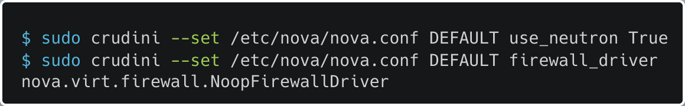

Настраиваем URL для использования сервиса **Glance**:

Указываем имя региона для сервиса **Cinder**:

Указываем путь к файлам блокировок:

Настраиваем параметры для подключения к сервису **Placement**:

На этом общие параметры заканчиваются и начинаются специфичные для **controller.test.local**:

Настраиваем пути к созданным БД (почему только к 2 из 3 я без понятия):

Указываем ip **controller.test.local**:

Указываем ip адрес на котором будет работать **VNC-сервер**:

Теперь можно инициализировать базу данных **nova-api**:

Также надо зарегистрировать базу данных **cell0** в БД **nova** и создать ячейку **cell1**:

Теперь заполняем (очень долго) БД **nova** (я уже сошел с нити понимания конфигурации):

8.3. Перед тем как запустить все сервисы **Nova** cконфигурируем и запустим сервис **Placement** (оказывается зарегистрировать его в **Keystone** было недостаточно):

Для этого создадим БД **placement** и выдадим разрешения:

Так-как в **Keystone** мы **placement** зарегистрировали, пропускаем этот шаг и заполняем файл конфига **/etc/placement/placement.conf**:

Синхронизируем БД **placement**:

8.4. Запускаем все службы **Nova** и перезапускаем **httpd** (насчет **openstack-nova-console** пока не знаю, поэтому не запускаю, так как в официальном гайде **Openstack** (не из книги) **openstack-nova-console** даже не скачивается):

8.5. На этом настройка сервиса **Nova** на **controller.test.local** закончена и можно переходить к настройке рабочих узлов (все настройки проводятся на **compute.test.local**, **compute-opt.test.loca**l аналогично, но с другими ip).

Первым делом устанавливаем пакеты **openstack-nova-compute** (служба **Nova** для рабочих узлов) **sysfsutils** (утилита получения информации о ВМ) **libvirt** (утилита виртуализации), если не качается фикс [**здесь**](#bookmark=id.tyjcwt):

Далее необходимо проверить поддержку аппаратной виртуализации на рабочем узле (**svm** — поддержка от Amd, **vmx** — от Intel):

Если вдруг аппаратная виртуализация не поддерживается (пустой вывод команды выше), то необходимо включить эмуляцию с помощью **QEMU**:

Теперь настраиваем конфигурационный файл сервиса **Nova** **/etc/nova/nova.conf**, для начала базовые параметры для всех узлов, о которых упоминалось [**ранее**](#bookmark=id.2s8eyo1):

Теперь устанавливаем параметры **/etc/nova/nova.conf** специфичные для рабочих узлов:

Указываем адрес вычислительного узла (**compute-opt** — **192.168.122.215**):

Включаем поддержку vnc, а также указываем что **VNC-серве**р будет слушать подключения на всех интерфейсах и URL прокси-сервера, где будет доступен браузеру интерфейс виртуальной машины:

Указываем адрес узла-клиента nvcproxy (**compute-opt** — **192.168.122.215**):

На этом работа с конфигом заканчивается и можно запускать сервисы **libvirtd** **openstack-nova-compute** (**openstack-nova-compute** не запустится, если **controller** узел не в сети):

8.6. Теперь проверяем что мы там настроили и заканчиваем синхронизацию на **controller** узле:

Проверяем видит ли **controller** узел наш **compute** узел:

Если видит, то регистрируем гипервизоры с помощью скрипта (вывод примерно такой, честно скажу, свой вывод для **compute.test.local** я потерял, так что взял вывод после подключения **compute-opt.test.local**):

Теперь можно проверить работу **Placement** API с помощью еще одного скрипта:

**Если скрипт выводит ошибку 403** — то вы такой же как и я (хотя как может быть по другому, если вы шли по этому гайду), так вот ошибка решается добавлением секции **\<Directory /usr/bin\>** в конфигурационный файл **httpd** для **Placement** API **/etc/httpd/conf.d/00-placement-api.conf** и последующим перезапуском сервиса **httpd**:

На этом настройка сервиса **Nova** закончилась (нашел [**крутой современный гайд**](https://www.informaticar.net/openstack-compute-installation-tutorial-centos/) на установку **Openstack**), теперь экспромтом покажу как настроить **nfs-клиента** на **compute-opt** узле, так как автоматически он его не создаст:

Во-первых вот так по итогу выглядит итоговый **/etc/hosts**, каждого узла нашего проекта:

**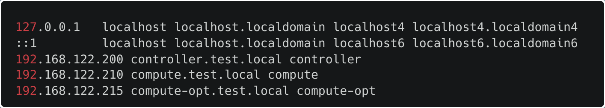**

Скачиваем и запускаем **nfs-server**:

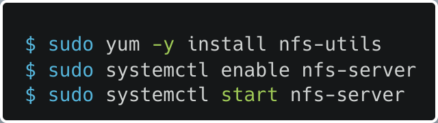

Создаем папку, в которую мы смонтируем **nfs-каталог**, и собственно монтируем в нее **nfs-каталог** нашего **nfs-сервера**:

Для того чтобы каталог автоматически монтировался, добавим соответствующую строку в файл **/etc/fstab** и применим конфигурацию:

-   **rw** — разрешение на чтение и запись
-   **sync** — все изменения сразу сбрасываются на диск без использования кэша
-   **hard** — клиент будет пинговать nfs-сервер, если тот станет недоступен
-   **intr** — монтирование можно прервать

9\. Установка и настройка сетевого сервиса Neutron

9.1. Про сервис Neutron написано много, так что введение будет большим. Для начала **Neutron** — реализует коммутацию (**NetFlow**, **RSPAN**, **SPAN**, **LACP**, **802.1q**, туннелирование **GRE** и **VXLAN**), балансировку нагрузки, брандмауэр и **VPN** в кластере **Openstack** (раз он сетевой сервис). Определим основные абстракции сервиса:

-   **сеть** – есть внутренние, виртуальные сети, которых может быть много, и как минимум одна внешняя. Доступ к виртуальным машинам внутри внутренней сети могут получить только машины в этой же сети или узлы, связанные через виртуальные маршрутизаторы. Внешняя сеть представляет собой отображение части реально существующей физической сети для обеспечения сетевой связанности виртуальных машин внутри облака и «внешнего мира».
-   **подсеть** – сеть должна иметь ассоциированные с ней подсети. Именно через подсеть задается конкретный диапазон IP-адресов
-   **маршрутизатор** – как и в физическом мире, служит для маршрутизации между сетями.
-   **группа безопасности** – набор правил брандмауэра, применяющихся к виртуальным машинам в этой группе
-   **«плавающий IP-адрес»** (Floating IP) – IP-адрес внешней сети, назначаемый экземпляру виртуальной машины. Он может быть выделен только из существующей внешней сети (по умолчанию каждый проект имеет квоту в 50 адресов)
-   **порт** – подключение к подсети. Порт на виртуальном коммутаторе. Включает в себя MAC-адрес и IP-адрес

Соответственно в кластере приходится иметь дело со следующими видами трафика:

-   **внешний трафик** — публичная сеть, которой принадлежат «реальные» IP-адреса виртуальных машин, а также демилитаризованная зона
-   **внутренний трафик** — сеть для операционных систем и служб (ssh и мониторинг), сеть для сетевой установки узлов под сервисы OpenStack, сеть для **IPMI**, **DRAC**, **iLO**, консолей коммутаторов и сеть передачи данных для служб **SDS** (**Swift**, **Ceph**, **iSCSI**, **NFS**)
-   **трафик виртуальных машин** — сеть связи внешнего трафика с ВМ
-   **трафик API и управления** — сеть, предоставляющая наружу публичный API и веб-интерфейс **Horizon**

Для функционирования Neutron нужно минимум три узла:

-   **узел управления** — узел с брокером сообщений (**controller.test.local**)
-   **сетевой узел** — **производительный** физический сервер или физический коммутатор
-   **вычислительный узел** — некоторые службы Neutron добавляются на каждый рабочий узел (**compute.test.local** и **compute-opt.test.local**)

Почему все используют **Neutron** вместо **nova-networ**k? Потому что в **Neutron** можно расширять API при помощи подключаемых модулей (в **nova-network** для настройки сети использовались только возможности ОС на которой работает узел), при этом у **Neutron** есть супер модуль **Modular Layer 2** (**ML2** – **OVS**/**LB**), позволяющий использовать сразу несколько технологий 2 уровня (раньше можно было только **LinuxBridge** или только **Open vSwitch**) путем использования специальных драйверов (присутствуют из коробки):

-   драйвера агентов, например **LinuxBridge** или **OVS**
-   драйвера контроллеров **SDN**, например **OpenDaylight**, **OpenContrail**, **VMware** **NSX** или **PLUMgrid**
-   драйвера аппаратных коммутаторов, например **Cisco** **Nexus** или **Extreme** **Networks**

Также можно качать сторонние [**драйвера**](https://wiki.openstack.org/wiki/Neutron_Plugins_and_Drivers) или разворачивать сервисы:

-   **маршрутизатор**
-   **балансировщик** **нагрузки** (LBaaS)
-   **брандмауэр** (FaaS)
-   **виртуальные** **частные** **сети** (VPNaaS)

Наконец на 65 странице можно частично понять смыл проектов **Openstack** — каждый проект может иметь свою сеть, соответственно один узел может иметь несколько адресных пространств которые даже могут пересекаться (несколько ARP таблиц и таблиц маршрутизации, наборов правил брандмауэра, сетевых устройств и т. д).

Что касается служб **Neutron**:

-   **neutron-server** – центральный управляющий компонент. Не занимается непосредственно маршрутизацией пакетов. С остальными компонентами взаимодействует через брокер сообщений **(сидит на узле управления)**
-   **neutron-openvswitch-agent** – взаимодействует с **neutron-server** через брокер сообщений и отдает команды **OVS** для построения таблицы потоков **(сидит на сетевом и рабочих узлах)**
-   **neutron-l3-agent** – обеспечивает маршрутизацию и NAT, используя технологию сетевых пространств имен **(сидит на сетевом узле)**
-   **openvswitch** – программный коммутатор, используемый для построения сетей **(сидит на сетевом и рабочих узлах)**
-   **neutron-dhcp-agent** – сервис отвечает за запуск и управление процессами dnsmasq, легковесного **dhcp-сервера** и сервиса кэширования DNS. Также **neutron-dhcp-agent** отвечает за запуск прокси-процессов сервера предоставления метаданных (каждая сеть, создаваемая агентом, получает собственное пространство имен **qdhcp-UUID_сети**) **(сидит на сетевом узле)**
-   **neutron-metadata-agent** – данный сервис позволяет виртуальным машинам запрашивать данные о себе, такие как имя узла, открытый **ssh-ключ** для аутентификации и др (ВМ получают эту информацию во время загрузки скриптом, обращаясь на адрес **http://169.254.169.254**. Агент проксирует соответствующие запросы к **openstack-nova-api** при помощи пространства имен маршрутизатора или **DHCP**) **(сидит на сетевом узле)**
-   **neutron-ovs-cleanup** – отвечает во время старта за удаление из базы данных **OVS** неиспользуемых мостов «старых» виртуальных машин **(сидит на сетевом узле)**

Итак что происходит в **Neutron** при создании ВМ через сервис **Nova**:

1.  Сервис **Nova** отправляет запрос на сервис neutron-server, отвечающий за API
2.  **Neutron-server** отправляет запрос агенту DHCP (**neutron-dhcp-agent**) на создание IP-адреса
3.  **Neutron-dhcp-agent** обращается к сервису **dnsmasq**, отвечающему за подсеть, в которой создается виртуальная машина
4.  **Dnsmasq** возвращает первый свободный IP-адрес из диапазона адресов подсети
5.  **Neutron-dhcp-agent** отправляет этот адрес сервису **neutron-server**
6.  После того как за виртуальной машиной закреплен IP-адрес, сервис **Neutron** отправляет запрос на **Open vSwitch** для создания конфигурации, включающей IP-адрес в существующую сеть.
7.  **Open vSwitch** возвращает обратно параметры конфигурации на сервис **Neutron** при помощи шины сообщений
8.  **Neutron** отправляет параметры конфигурации сервису **Nova**
9.  Конец

Небольшая сноска перед следующим пунктом, я тут нашел рекомендуемые требования к узлам… (у меня всего 8GB, возможно в скором времени мне это все еще как аукнется, как минимум **Swift** и **Ceph** даже если бы хотел развернуть не смог), в такие моменты внезапно понимаешь, что по идее эти узлы должны одновременно запущены 24/7 и их не надо останавливать, чтобы перестать ловить фризы всей системы, а ведь впереди еще как минимум 3 сервиса.

9.2. Начинаем установку и настройку сервиса **Neutron** на узле управления (**controller.test.local**):

На всякий случай сделаем снимок состояния виртуалки, а то мне кажется,что грань великих тормозов все ближе:

Устанавливаем пакеты **openstack-neutron** (службы **Neutron**) **openstack-neutron-ml2** (тот самый [**волшебный модуль**](#bookmark=id.17dp8vu)):

Классическое создание БД для сервиса, на это раз как нетрудно понять БД зовется **neutron**:

Далее… да вы угадали — регистрируем сервис в **Keystone**:

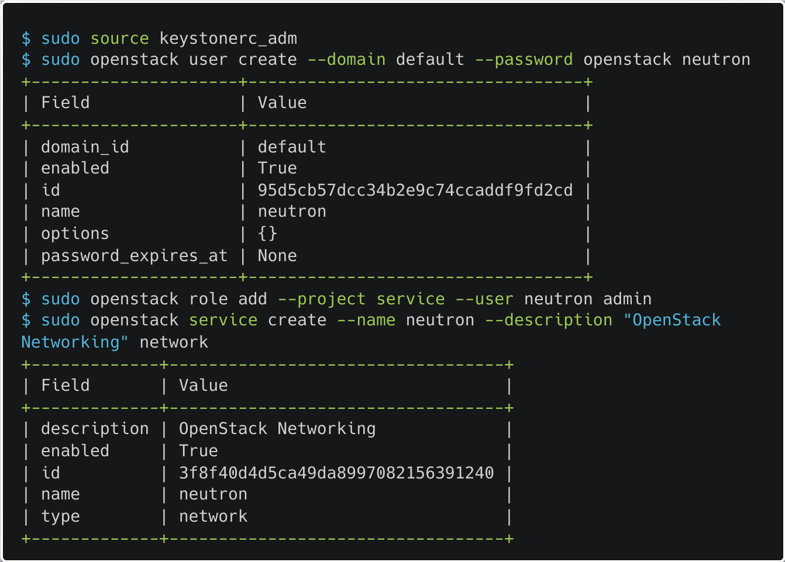

Далее идут общие параметры конфигурационных файлов для сетевого, рабочих и управляющего узлов. **Neutron** — король по количеству настроек, вот описание файлов конфигураций, которые мы будем изменять:

-   **/etc/neutron/neutron.conf** — основной конфиг **Neutron**
-   **/etc/neutron/plugins/ml2/ml2_conf.ini —** конфиг модуля **ML2**
-   **/etc/neutron/plugin.ini —** ссылка на конфиг **ML2**, там прикол, что если не будет ссылки то конфиг **ML2** не подключится, так как находится в другой папке.
-   **/etc/neutron/l3_agent.ini** — конфиг **L3-агента** (отвечает за маршрутизацию)
-   **/etc/neutron/dhcp_agent.ini** — конфиг **DHCP-агента**
-   **/etc/neutron/metadata_agent.ini** — конфиг агента, предоставляющего метаданные виртуальным машинам
-   **/etc/neutron/plugins/ml2/openvswitch_agent.ini** — конфиг агента **Open vSwitch** для модуля **ML2**

Ну что приступаем к настройке **/etc/neutron/neutron.conf**, первым делом настраиваем базовые вещи (подключение к брокеру сообщений и аутентификацию **Keystone**):

Указываем название основного подключаемого модуля второго уровня модели OSI (также есть : **hyperv**, **cisco**, **brocade**, **embrance**, **vmware**, **nec** и др):

Указываем погружаемые модули (из **router**, **firewall**, **lbaas**, **vpnaas**, **metering**), подгружаем только маршрутизатор:

Настройка разрешения пересечения IP внутри проектов:

Забыл настроить путь к файлам блокировки:

Настройка **/etc/neutron/neutron.conf** закончена (вроде как), теперь настраиваем **/etc/neutron/plugins/ml2/ml2_conf.ini**:

Настраиваем используемые сегменты сетей (выбор из: **flat**, **GRE**, **VLAN**, **VXLAN** и **local**):

Настраиваем технологии используемые для сетей проектов (поддерживающие пересечение IP: **GRE**, **VLAN**, **VXLAN** и **flat**):

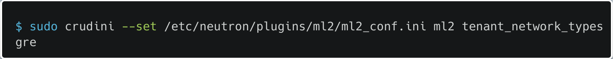

Настраиваем тип драйвера механизма **ML2** (выбор из: **openvswitch**, **mlnx**, **arista**, **cisco**, **logger**, **linuxbridge** и **brocade**):

Настраиваем диапазон ID для [**GRE-туннелей**](https://wiki.dieg.info/gre):

Включаем группы безопасности [**ipset**](https://www.dmosk.ru/terminus.php?object=ipset):

Выше были настройки общие для всех узлов, теперь пойдут настройки только для управляющего узла:

Настраиваем параметры подключения к БД:

Настраиваем отправку уведомлений сервису **Nova** при изменении статуса портов и IP-адресов:

Настраиваем параметры подключения к **Keystone** сервиса **Nova** (видимо **Neutron** нужно в определенных обстоятельствах нужно выдавать себя за **Nova**):

Переносим все заботы о сети с сервиса **Nova** на **Neutron** в файле **/etc/nova/nova.conf** (еще брандмауэр **Nova** вырубаем), третью команду отдельно выносить не буду, там мы задаем поддержку **Open vSwitch**:

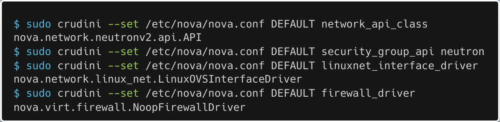

Настраиваем параметры аутентификации **Neutron** для **Nova**, если раньше мы писали их в **/etc/neutron/neutron.conf**, то теперь в **/etc/nova/nova.conf**:

Теперь можно синхронизировать БД:

У меня вылезла ошибка **«No module named MySQLdb»**, почему только сейчас известно только разрабам **Openstack** (хотя вывод скрипта огромный, мб он единственный использует это модуль), но фиксится она как нетрудно догадаться скачиванием данного модуля (после снапшота, я теперь готов все что угодно качать):

Теперь создаем ссылку на конфиг ML2 в папке настроек Neutron **/etc/neutron/**:

Указываем использование прокси для сервера метаданных и общий секрет, которым будут подписываться запросы к серверу метаданных в конфиге **/etc/nova/nova.conf:**

****

По итогу на узле управления в конфиги добавляются следующие параметры:

Перезапускаем сервисы **nova** и стартуем сервис **neutron-server**:

Проверка итога настройки:

9.3. Теперь я оказался на перепутье ведь надо настраивать сетевой узел как отдельный узел, а ноутбук уже просит пощады, так что мой выбор пал на разворачивание сетевого узла на узле управления, может выйти гениально, а может и нет (но я ведь не зря снимок сделал). Далее я буду писать как будто настраиваю отдельный узел, но делать пометки лишних действий, так как некоторые уже делал при настройке узла управления:

Начнем с установки необходимых пакетов (если как и я устанавливаете на узел управления, то **openstack-neutron** и **openstack-neutron-ml2** качать не надо) **openstack-neutron-openvswitch** (модуль openvswitch для openstack) и [**openvswitch**](https://habr.com/ru/post/325560/) (программный коммутатор):

Далее идет установка всех общих параметров конфигов (на узле управления уже установлены) и создание ссылки на конфиг в **/etc/neutron/plugins/ml2/ml2_conf.ini**:

Дальше уже страшно, так как нужно внести изменения в параметры ядра, а именно включить маршрутизацию пакетов (**net.ipv4.ip_forward**) и выключить фильтрацию пакетов по их исходящему адресу (**net.ipv4.conf.all.rp_filter** и **net.ipv4.conf.default.rp_filter**):

Настраиваем конфиг **ML2** **/etc/neutron/plugins/ml2/ml2_conf.ini**, указывая [**flat**](https://wiki5.ru/wiki/Flat_network) провайдер для внешней сети:

Настраиваем конфиг **Open vSwitch** **/etc/neutron/plugins/ml2/openvswitch_agent.ini**:

Указываем IP-адрес для конечной точки туннеля (ip узла управления):

Сопоставляем внешнюю сеть созданному мосту **br-ex**:

Настраиваем включение **GRE-туннелирования**:

Настраиваем конфиг **L3-агента** (маршрутизация) **/etc/neutron/l3_agent.ini**:

Указываем драйвер **Open vSwitch**:

Настраиваем использование **namespace**:

Указываем имя, используемого моста:

Настраиваем удаление неиспользуемых **namespace**:

Настраиваем конфиг **DHCP-агента** **/etc/neutron/dhcp_agent.ini**:

Указываем драйвер **Open vSwitch**:

Указываем **Dnsmasq** DHCP-драйвер:

Настраиваем использование и удаление **namespace**:

Настриваем конфиг агента-метаданных **/etc/neutron/metadata_agent.ini**:

Указываем IP-адрес управляющего узла:

Указываем общий секрет, используемый для получения метаданных;

Дополнительные параметры конфигов сетевого (управляющего) узла:

Запускаем и включаем **Open vSwitch**:

Я тут понял, что в определенный момент перестал показывать скрины статусов, но не переживайте, все работает без ошибок.

Ухх, господа, теперь [**надо создать сетевой интерфейс**](https://bozza.ru/art-266.html) для нашей так называемой внутренней сети (в книге он был с первой главы, в то время как у меня был только **eth0** на всех ВМ), так что выходим из нашей виртуалки на хост и начинаем создавать новую сеть типа bridge:

Первым делом создаем файл конфигурации сети **private.xml** (я просто скопировал содержимое файла **/etc/libvirt/qemu/networks/default.xml** и поменял ip и удалил части, которые генерируются автоматически), потому что **virsh** почему-то не может создать сеть через параметры командной строки (Привет это Артем и будущего, я ошибся в ip адресах и фиксил это один день своей жизни, не беспокойтесь скрины уже исправлены):

Создаем сеть с помощью **virsh**:

Включаем автостарт сети private (перед настройкой автостарта, нужно открыть конфиг сети через **net-edit**, чтобы первоначальные настройки сети применились):

Должен появится сетевой интерфейс **virbr3** на хосте:

Теперь можно запускать **VM2** (**controller.test.local**) и присоединить к ней сетевой интерфейс (команда выполняется на хосте):

Внутри ВМ должен появится новый интерфейс **eth1**:

На этом все, сетевой интерфейс к машине присоединен, теперь можно перейти к его настройке для сетевого (у меня управляющего) узла для сервиса **Neutron**:

Создаем файл **/etc/sysconfig/network-scripts/ifcfg-eth1** и пишем в него следующие настройки и перезапускаем сеть (Опять Артем из будущего, короче с конфигами были тоже проблемы и пришлось добавить файл **/etc/sysconfig/network-scripts/ifcfg-br-ex** специально для моста):

Теперь надо добавить мост **br-ex** для Open vSwitch, который будет находится на созданном интерфейсе **etn1**:

Проверяем все ли подключилось нормально при помощи **ovs-vsctl**:

Вроде все круто, так что можно запускать все службы **Neutron** для сетевого (сами знаете какого) узла (насколько я понял ovscleanup стартовать не надо):

Вместо того, чтобы проверять статус каждой службы можно посмотреть все одной командой:

Теперь переходим к настройке служб **Neutron** на рабочих узлах **compute** и **compute-opt**:

Качаем необходимые пакеты (все уже обсуждались раньше):

Теперь заполняем общие для всех узлов параметры конфигов для сервиса **Neutron**, и создаем ссылку на конфиг **ML2**:

Базу выполнили, теперь изменяем параметры ядра **net.ipv4.conf.all.rp_filter** и **net.ipv4.conf.default.rp_filter** (отключение фильтрации пакетов), **net.bridge.bridge-nf-call-iptables** (пакеты с сетевого моста передаются на обработку **iptables**):

Если последняя строка не выполняется то выполните следующую команду (включает модуль ядра [**br_netfilter**](https://ebtables.netfilter.org/documentation/bridge-nf.html)), а потом опять **sysctl**:

Так, ну теперь пошли специфичные для рабочих узлов параметры конфигов:

Настраиваем конфиг **Open vSwitch** **/etc/neutron/plugins/ml2/openvswitch_agent.ini**:

Указываем локальный ip вычислительного узла (**compute-opt** — **192.168.122.215**):

Указываем тип используемой технологии туннеля:

Указываем драйвер брандмауэра (**iptables** на **Open vSwitch**):

Запускаем **Open vSwitch**, так как его настройка закончена:

Настраиваем конфиг сервиса **Nova** **/etc/nova/nova.conf**:

Передаем полномочия (первые 3 команды) с службы **nova-network** на **Neutron**, а также отключаем службу брандмауэра в **Nova** (последняя команда):

Указываем параметры аутентификации **Neutron** (как и на управляющем узле):

Персональные параметры рабочих узлов:

Перезапускаем службу **nova-compute** и запускаем агента **Open vSwitch**:

Должны появится новые сетевые агенты в выводе команды, по одному на рабочий узел (я пока настроил только один):

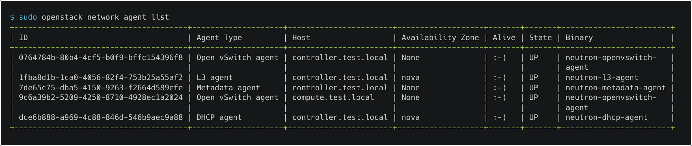

Все, с сервисом **Neutron** пока покончено, как и с основными (точнее 6 из 7, без Swift) сервисами **Openstack**. Осталось только поработать с созданием ВМ и сетей для них, а также установить доп сервисы для удобства (**Horizon**, **Gnocchi**. **Ceilometer**, **Aodh** и **Heat**). Есть также некоторые сомнения касательно подключения дополнительных сетевых интерфейсов для рабочих узлов (пока не подключаю), если их надо будет добавить, естественно, сделаю сноску (**не надо**).

10\. Тестим все то, что на разворачивали.

10.1. Для начала создадим все необходимые компоненты сетевой инфраструктуры для запуска первой ВМ:

Создаем внешнюю сеть **ext-net**:

Из-за опечатки в книге (вместо **--provider-physical-network** **external** было написано **--provider-physical-network datacentre**) я потратил очередные 2 часа своей жизни на исправление бага… А ведь это уже 4 издание книги.

-   **--external** — сеть является внешней (есть средство внешней маршрутизации)
-   **--share** — сеть доступна всем проектам
-   **--provider-network-type** — физический механизм, с помощью которого реализуется виртуальная сеть (**flat**, **geneve**, **gre**, **local**, **vlan**, **vxlan**)
-   **--provider-physical-network** — имя физической сети, в которой реализована виртуальная сеть (мы мапили это название с созданным мостом, а потом объявляли его возможным для использования в типе сети **flat**)

Теперь создадим подсеть, из которой будут выделяться плавающие IP-адреса (в реальности они должны быть видны из интернета).

-   **--network** — сеть родитель
-   **--no-dhcp** — без DHCP
-   **--allocation-pool** — доступные ip адреса
-   **--gateway** — дефолтный шлюз во внешнюю сеть (ip маршрутизатора)
-   **--subnet-range** — маска подсети

Теперь переквалифицируемся в пользователя demo и создаем сеть в его личном проекте:

Создаем подсеть (**demo-subnet**) нашей **demo-net**:

Создаем роутер (**demo-router**) для **demo-subnet**:

Добавляем подсеть **demo-subnet** к роутеру **demo-router**:

**Отступление от темы**: у меня уже начинаются убиваться процессы на виртуалке из-за нехватки оперативки.

Теперь выставляем внешний шлюз для роутера **demo-router**:

Вот примерные параметры роутера **demo-router**:

10.2. Теперь переходим к созданию экземпляра ВМ:

А, попались, думали уже можно создать ВМ, неа еще надо создать **flavour** (шаблон виртуальной машины по выделяемым ресурсам) перед этим. Шаблоны по умолчанию может создавать только админ:

-   **--ram** — оперативная память
-   **--disk** — размер диска
-   **--vcpu** — количество виртуальных ядер CPU
-   **--public** — доступен всем пользователям
-   **--rxtx-factor** — пропускная способность сети (только для гипервизора **XEN**)
-   **--ephemeral** — размер второго диска (в отличии от **--disk** всегда удаляется при удалении ВМ)
-   **--swap** — размер опционального [**swap-раздела**](https://fornex.com/ru/help/swap/#:~:text=SWAP%20(%D1%81%D0%B2%D0%BE%D0%BF)%20%E2%80%94%20%D1%8D%D1%82%D0%BE%20%D0%BC%D0%B5%D1%85%D0%B0%D0%BD%D0%B8%D0%B7%D0%BC,%2C%20%D0%BD%D0%B0%D0%B7%D1%8B%D0%B2%D0%B0%D0%B5%D0%BC%D1%8B%D0%B5%20%D1%81%D1%82%D1%80%D0%B0%D0%BD%D0%B8%D1%86%D0%B0%D0%BC%D0%B8%20(pages).)

Выделил контроллер узлу еще 2GB оперативки, надеюсь хватит, но я уже вхожу в зону «выделил ресурсов больше чем на самом деле» (2+2+6=8)

Теперь создадим пару **ssh-ключей**, которую служба метаданных сервиса **Nova** будет передавать созданным ВМ:

Вхожу в теневую зону (запускаю сразу 3 ВМ) и пытаюсь создать ВМ по созданному шаблону **m2.tiny**, передав в нее созданную пару ключей **demokey1** (если на этом отчет закончился, то это потому что у меня взорвался ноутбук):

При запуске обоих рабочих узлов, узел управления сразу падает, видимо kvm не любит избыточность ресурсов, поэтому прощай **compute-opt**. Лагануло при создании ВМ у меня знатно.

**Изливаю очередной бомбеж:** я весь день (5 часов подряд) пытался пофиксить ошибку **UnicodeDecodeError** (ошибки можно найти в **логах**, выводе команд **journalctl** и **openstack server show имя_ВМ**), которая вылезала при создании ВМ, к 5 часу я уже редачил питоновские файлы по гайдам на китайском языке, но все равно ошибка коварно вылезала, а потом я перезагрузил (в 3 раз за 5 часов) виртуалки и все пофиксилось, вот как-то так...

Посмотреть статус созданной ВМ можно как с помощью **openstack cli**, так и при помощи **virsh** на рабочем узле:

На рабочем узле:

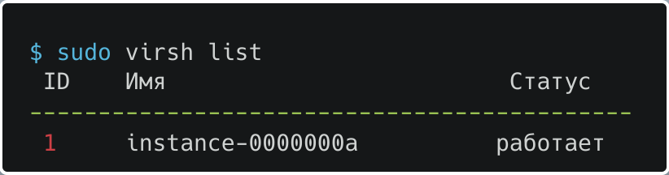

Теперь можно подключится к ВМ через **noVNC** (**VNC** через браузер), получив URL с помощью **openstack cli**:

Пишем полученный URL в строку браузера и получаем доступ к консоли ВМ **myinctance1** (у меня на хосте не настроено сопоставление DNS с ip, так что я заменил **controller.test.local** на **192.168.122.200**):

Вот скрины из книги о том как создается ВМ (запрос путешествует по всем сервисам):

Теперь раз ВМ включена то должна начать записываться статистика по потреблению ей ресурсов:

Теперь надо добавить к ВМ сеть, чтобы к ней например можно было подключаться через SSH:

Первым делом надо создать группу безопасности **demo-sgrpoup** (набор правил брандмауэра, разрешающих доступ к тем или иным портам виртуальной машины), так как к ВМ автоматически добавилась группа **default**, которая ничего не разрешает:

Теперь добавим 2 правила: первое разрешает доступ по SSH, второе разрешает протокол ICMP:

Посмотреть установленные правила можно так:

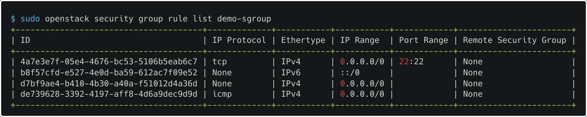

Теперь можно добавить группу безопасности **demo-sgroup** ВМ **myinsatnce1** и удалить группу **default** (также можно указывать группу безопасности при запуске ВМ при помощи флага **--security-groups**), заодно держите удобный способ просмотра отдельных параметров вывода команды:

Группу безопасности добавили теперь надо выделить ip из внешней сети **ext-net** и добавить его нашей ВМ для подключения:

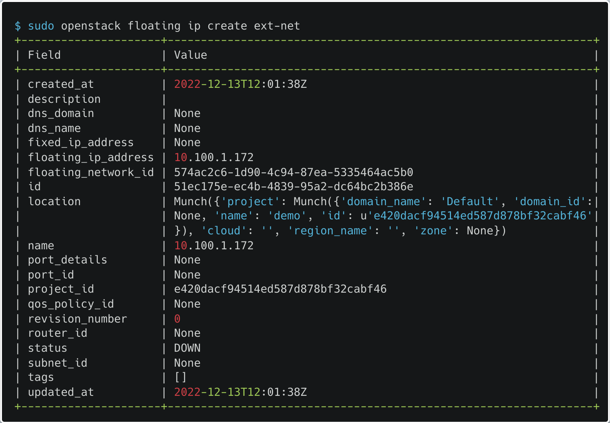

Не переживайте, что у меня ВМ вырублена, это просто чтобы ноут не зависал:

Теперь с помощью SSH можно подключится к созданной виртуалке по предоставленному ей плавающему ip (только перед этим надо выдать другие разрешения на файл ключей **demokey1**, а то SSH его проигнорирует из-за недостаточной безопасности):

10.3. Переходим к тестированию создания снимков и резервных копий ВМ:

Когда-то там мы создавали мы создавали том **testvlo1**, его и используем:

Добавим том **testvol1** к ВМ **myintsance1** (можно подключать во время создания ВМ при помощи флага **--block-device-mapping**), добавляем к ВМ по id (не по имени ВМ), потому что **admin** не видит ВМ **myintsance1**, так как она находится в другом проекте (опять китайцы помогли исправить баг, на этот раз **OSError: no such file or directory**, не знаю из-за устаревшей книги или из-за чего еще но в файл конфига сервиса **Cinder /etc/cinder/cinder.conf** надо добавить параметр **target_helper** то ли вместо **iscsi_helper** то ли вместе (че поделать все на китайском написано), я добавил вместе и все заработало):

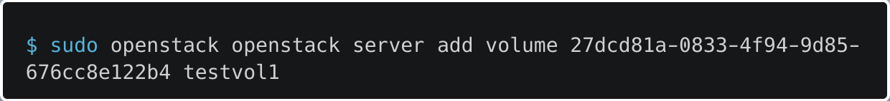

Теперь он должен стать помечен как использующийся (**in-use**):

Заходим в ВМ и смотрим наличие тома (потом можно смонтировать на него файловую систему и тд, но я делать этого не буду):

С томами все теперь переходим к снимкам. Важное уточнение оказывается снимок в **openstack** не является точкой восстановления для существующей ВМ (как в KVM), а является самостоятельным образом (как и скачанный нами **cirros**). Поэтому сники в **Openstack** используются для резервного копирования или создания нового базового образа. Так теперь надо сделать какое-нибудь видное изменение в ВМ **myinstance1**, которое можно было бы увидеть в новой ВМ **myinstance2** созданной из снимка ВМ **myinstance1** (можно сделать снимок тома (**volume snapshot**) и ВМ (**image create**)).

Создадим файл тест в **root** каталоге:

Теперь создаем снимок **myinstance1_sn1** ВМ **myinstance1**, и проверяем его появление в сервисе **Glance**:

Теперь запускаем новую ВМ **myinstance2**, используя созданный снимок **myinstance1_sn1**:

Заходим в нее через браузер и смотрим присутствуют ли изменения в ВМ **myinstance2**:

Два совета из книги: если вы работаете с виртуальными машинами **Fedora**, **CentOS**, **RHEL** или им подобными, необходимо перед созданием снимка удалить правило udev для сети, иначе новый экземпляр не сможет создать сетевого интерфейса:

Если виртуальная машина запущена во время создания снимка, необходимо сбросить на диск содержимое всех файловых буферов и исключить дисковый ввод/вывод каких-либо процессов:

Отличия **резервных копий** от **снимков**:

-   резервная копия сохраняется в объектное хранилище, а не в сервис работы с образами
-   резервная копия занимает столько места, сколько занимают данные, а моментальный снимок копирует весь образ полностью
-   резервную копию можно восстановить на новый том, а из моментального снимка можно запустить новый экземпляр виртуальной машины
-   в отличие от создания моментального снимка, нельзя делать резервную копию используемого тома

Узнав отличия снимков от резервных копий, можно перейти созданию резервной копии тома **testvol1** (**--force** нужен чтобы бэкапить том в состоянии **in-use**):

Теперь тестируем восстановление тома (статус восстановления можно смотреть как и статус запуска ВМ), у меня бэкап не вышел (вылезает ошибка **MemoryError**, так что скорее всего просто мощности не хватает узлу), но команда вот:

10.4. Особая тема шифрования томов **Cinder**. Шифрование необходимо при общении сервисов **Cinder** и **Nova** и реализуется либо при помощи общего секрета (делаем так), либо при помощи Barbican (сервис управления ключами, у меня нет и не будет в ближайшем будущем). Понятное дело, что если секрет скомпрометирован, то злодей может получить доступ ко всем томам, так что в реальной жизни его хорошо прячем.

Задаем значение секрета в конфигах сервисов **Nova** (**/etc/nova/nova.conf**) и **Cinder** (**/etc/cinder/cinder.conf**) и перезапускаем сервисы:

На вычислительных узлах:

На управляющем узле:

Создаем новый тип тома [**LUKS**](https://en.wikipedia.org/wiki/Linux_Unified_Key_Setup):

****

-   **--encryption-provider** — драйвер обеспечивающий поддержку шифрования
-   **--encryption-cipher** — алгоритм или режим шифрования
-   **--encryption-key-size** — размер ключа шифрования
-   **--encryption-control-location** — служба в которой выполняется шифрование

Теперь создаем сам зашифрованный том (создать его не получится, так как фича с ключами без использования сервиса Barbican устарела, и теперь надо обязательно его разворачивать, чего я пока делать не буду, но команда с примерным выводом вот):

-   **--size** — размер тома в ГБ
-   **--type** — тип тома

С томами все.

10.4. Переходим к тестированию квот на ресурсы. Они используются для управления вычислительными ресурсами и дисковым пространством в разрезе проекта, но можно и для всех пользователей.

Дефолтные квоты всех проектов:

Также можно смотреть квоты для определенного проекта, например **demo**:

Можно кенчно самому повыставлять квот, но опыт **LimitRange** и **ResourceQuota** при работе с **Kubernetes** говорит мне переходить к следующему пункту.

10.5. Итак зоны доступности и агрегаторы вычислительных узлов. Зоны доступности позволяют группировать узлы **OpenStack** в логические группы с общим элементом доступности (например одна стойка или одно здание) и по умолчанию все узлы находятся в зоне **nova**. Агрегаторы узлов же – это логическое объединение узлов с привязкой дополнительных метаданных. Агрегаторы позволяют группировать узлы по различным специфическим признакам (потом **Nova** автоматически будет разворачивать ВМ на более подходящих узлах). У меня один узел уже умер, но я решил все равно рассказать про эти объекты.

Для примера и тестирования создадим агрегатор **MyAggregate**:

Добавим в агрегатор **MyAggregate** рабочий узел **compute.test.local** (один узел может состоять в нескольких агрегаторах):

Добавим метаданные агрегатору **MyAggregate**:

Создадим новый тип (**flavour**) ВМ **m2.mynewmdvm** (с помощью него затестим агрегатор):

Добавим к созданному типу ВМ **m2.mynewmdvm** метаданные, чтобы ВМ этого типа могли располагаться только на узлах определенного агрегатора **MyAggregate** и проверим получившийся тип:

Все теперь ВМ этого типа будет стартовать только на узле **compute.test.local**, так как метаданные типа ВМ **m2.mynewmdvm** и агрегатора **MyAggregate** в котором состоит узел совпадают (поверьте на слово ибо одновременно два рабочих узла поднять я не могу).

Зона доступности, как можно понять, является недоагрегатором, и ее можно создать если приписать агрегатору определенное имя зоны доступности, вот пример (агрегатор — **MyAggregateZ**, имя зоны — **MyZone**):

Потом можно добавить узел **compute-opt.test.local** в данный агрегатор **MyAggregateZ**, и зона доступности узла изменится:

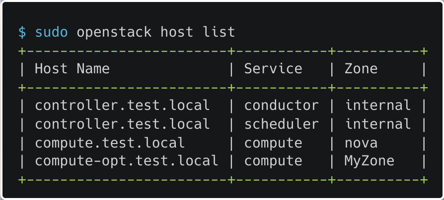

Теперь можно запустить ВМ с указанием зоны доступности (**--availability-zone**) и она развернется исключительно на узле **compute-opt.test.local** (если он у вас конечно работает, у меня просто уже нет **compute-opt** узла так что держите только пример):

Также можно изменить дефолтную зону доступности для кластера при помощи параметра **default_availability_zone** в **/etc/nova/nova.conf** на управляющем узле.

Тест закончен, удаляем узлы из агрегаторов и сами агрегаторы **MyAggregate** и **MyAggregateZ**:

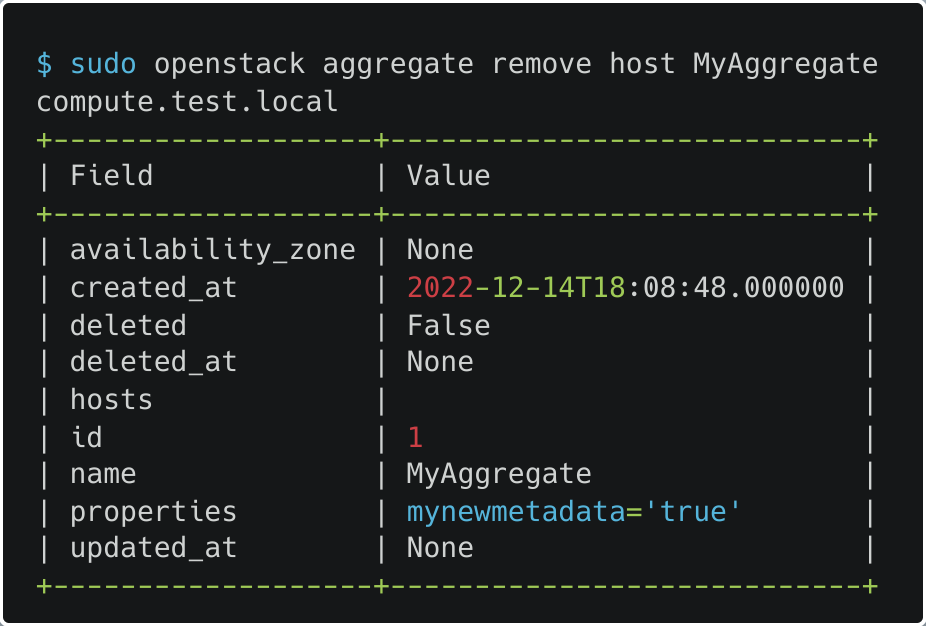

Также стоит отметить зоны доступности **Cinder**, чтобы монтировать подходящие для ВМ тома (принцип действия абсолютно такой же).

10.6. Тестируем живую миграцию ВМ. Есть два типа миграции:

-   с общей системой хранения данных. Виртуальная машина перемещается между двумя вычислительными узлами с общим хранилищем, к которым оба узла имеют доступ (например **NFS**, **Ceph** или вариант, когда не используются временные диски (которые удаляются при удалении ВМ), а в качестве единственной системы хранения при создании виртуальных машин используется **Cinder**)
-   без общей системы хранения данных. В этом случае на миграцию требуется больше времени, поскольку виртуальная машина копируется целиком с узла на узел по сети.

У меня миграцию произвести не выйдет, так как не могу одновременно запустить два рабочих узла, но шаги я опишу (правда без выводов команд).

Первым делом проверяем видят ли рабочие узлы **compute** и **compute-opt** друг друга:

На **compute-opt** узле:

На **compute** узле:

Теперь запускаем ВМ **test** и смотрим на каком узле она находится, а также достаточно ли ресурсов на другом узле:

Разрешаем демону **libvirtd** слушать входящие подключения по сети, добавив следующую опцию в файл **/etc/sysconfig/libvirtd.conf** на обоих рабочих узлах:

****

Разрешаем подключение без аутентификации и шифрования к демону **libvirtd**, редактируя файл конфига **/etc/libvirt/libvirtd.conf** (можно также использовать сертификаты или протокол [**Kerberos**](https://ru.bmstu.wiki/Kerberos)), после чего перезапускаем демон:

****

Далее надо добавить флаги миграции в файл конфига **/etc/nova/nova.conf** на обоих рабочих узлах (параметр уже устарел, так что я не смог найти подробную информацию) и перезапустить службу **nova-compute**:

****

****

Теперь можно осуществить живую миграцию на другой узел (**--block-migrate** — миграция без общего дискового хранилища):

****

Смотрим, где теперь работает ВМ (если все получилось, то на другом узле):

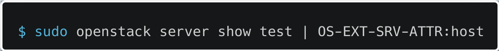

Информацию о миграции можно найти в параметрах ВМ, которая мигрирует:

10.7. Удобный (или нет) способ конфигурировать ВМ при запуске по названием [**cloud-init**](https://cloudinit.readthedocs.io/en/latest/topics/examples.html#yaml-examples). Заключается в создании **YAML-файлов** с синтаксисом **cloud-config**, в которые записываются описываются модули, исполняемые во время загрузки ВМ (например модуль установки пакетов), после содержимое **YAML-файла** передаются при создании ВМ (при помощи флага **--user-data**) и конфигурирует виртуалку (например задает имя хоста или предустанавливает пакеты).

Вот пример содержимого YAML-файла **cloud-config**, задающего имя ВМ:

После чего этот файл можно передать при создании ВМ **testvm**, и на ней как нетрудно догадаться имя хоста будет **testvm.test.local** (зайти в ВМ можно через **noVNC**):

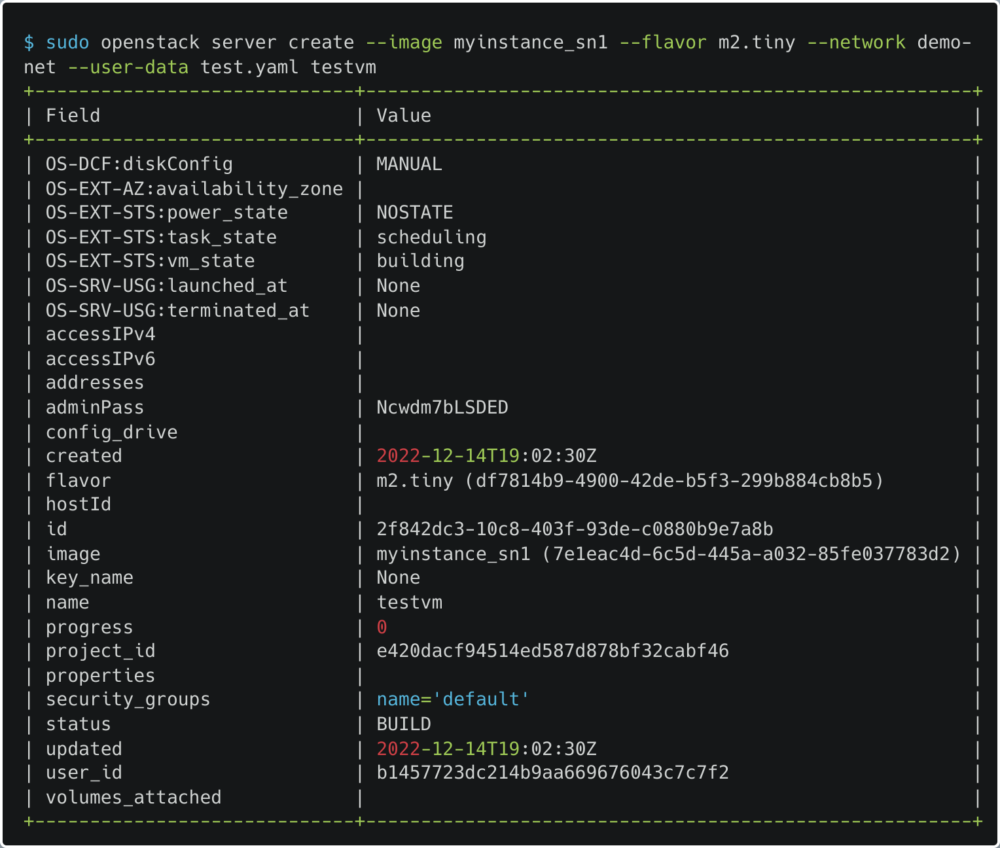

Все на этом можно закончить тесты базовой работы кластера и перейти к установке оставшихся сервисов.

11\. Установка и настройка сервиса веб-панели управления Horizon.

11.1. Сервис представляет собой удобный графический интерфейс в виде веб-приложения (на **Python/Django**), через который можно работать с Openstack. Больше собственно сказать о нем нечего, разве что на нем пока представлено только 70% функционала **openstack cli**.

11.2. Теории не много, так что приступаем к установке и конфигурации.

Первым делом устанавливаем необходимые пакеты **httpd** (Apache HTTP сервер) **mod_ssl** (модуль **Apache**, обеспечивающий криптографию через протоколы SSL и TLS) **mod_wsgi** (модуль **Apache**, предоставляющий интерфейс для работы с **web-приложениями**, написанными на **Python**) **memcached** (сервис кэширования данных в оперативной памяти на основе хеш-таблицы) **python-memcached** (Python интерфейс для работы с **memcached**) **openstack-dashboard** (сервис **Horizon**) на **controller.test.local узел** (некоторые пакеты уже установлены, но все равно их перечислю, так как **Horizon** можно установить и на другие узлы и даже ВМ):

Теперь конфигурируем конфиг **/etc/openstack-dashboard/local_settings** сервиса **Horizon**, изменяя опции

-   **OPENSTACK_HOST** — IP-адрес узла, где запущен Keystone (или имя)
-   **ALLOWED_HOSTS** — разрешенные ip для пользования **Horizon** (**[“\*“]** - все могут, но желательно перечислить избранных через запятую)
-   **SESSION_TIMEOUT** — время жизни сессии в **Horizon** в секундах, можно увеличить тут и в конфиге **Keystone** (e**xpiration=3600** секции **[Token]**) если образы ВМ очень большие и долго грузятся
-   **WEBROOT** — URL панели мониторинга относительно ip хоста (этот параметр я вымучил кровью и потом, почему-то с определенного момента ни один шаг не проходит без каких-либо ошибок)
-   **SESSION_ENGINE** — указание модуль обработки сеансов ([**Django**](https://django.fun/ru/docs/django/4.1/topics/http/sessions/)) пользователя
-   **CACHES** — сервис кэширования и его местоположение (ip адрес)
-   **OPENSTACK_KEYSTONE_URL** — URL сервиса **Keystone**, но мы его редачим, чтобы включить третью версию API (у меня редачить не пришлось)
-   **OPENSTACK_KEYSTONE_MULTIDOMAIN_SUPPORT** — поддержка доменов (openstack доменов, не путать с обычными)
-   **OPENSTACK_API_VERSIONS** - поддерживаемые версии API сервисов
-   **OPENSTACK_KEYSTONE_DEFAULT_DOMAIN** — имя домена по умолчаниЮ

Теперь указываем параметр **WSGIApplicationGroup** (группа приложений в которой будет запускаться **Horizon**, в книге написано, что это фиксит некоторые баги) в файле конфига **/etc/httpd/conf.d/openstack-dashboard.conf** и перезапускаем службы **httpd** и **memcached**:

****

****

****

Веб-интерфейс Horizon будет нас ждать по адресу [**http://controller.test.local/dashboard**](http://controller.test.local/dashboard) (в моем случае <http://192.168.122.200/dashboard>):

Как же тяжело даются последние сервисы, короче у меня при авторизации вылезала ошибка «**InternalServerError**», и мало, что она вылезала дак к этому еще файл логов ошибок **httpd /var/log/httpd/error_log** решил сломать вывод времени ошибки (выводил время ошибки на три часа раньше чем на самом деле). Вообщем оказалось, что проблема в **memcached**, который блокал весь трафик, кроме **localhost**, по итогу надо было поменять параметр **OPTIONS** и все заработало (еще я почистил кэш браузера мб это тоже помогло):

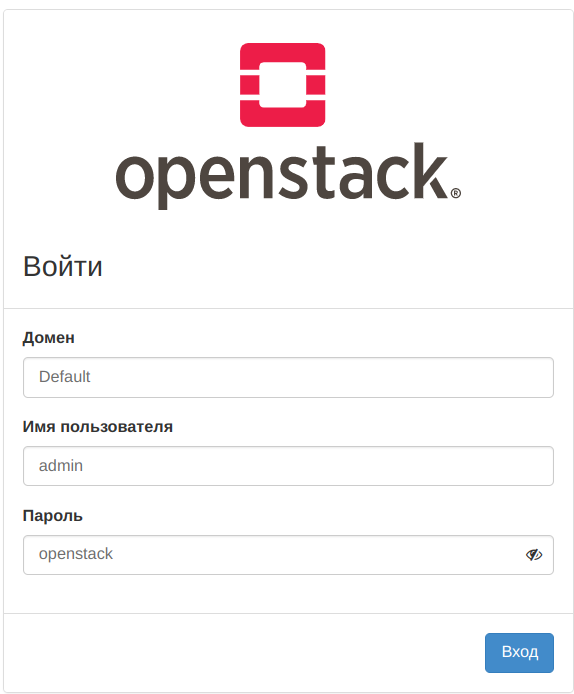

11.3. **Horizon** запустили теперь смотрим что внутри.

Заходим за пользователя **demo** и видим следующую картину:

Содержимое главной вкладки **Проект**:

-   **Вычислительные ресурсы**:
    -   **Обзор** – общий обзор ресурсов пользователя. Можно посмотреть текущее потребление ресурсов, а также получить краткий отчет за это время
    -   **Инстансы** – список виртуальных машин для текущего проекта, а также возможность производить с виртуальными машинами различные действия, например создание новой виртуальной машины или подключение к консоли и просмотр вывод терминала виртуальной машины
    -   **Образы** – управление образами **Glance**. Тут же из образа можно стартовать виртуальную машину и создать том
    -   **Ключевые** **пары** — управление ключами доступа по SSH
    -   **Доступ** **к API** — URL, по которым доступны API соответствующих служб облака
    -   **Группы** **серверов** — управление группами серверов (придуманы, чтобы напрмер запретить ВМ внутри группы подниматься на одном узле)
-   **Диски**
    -   **Диски** — управление томами (все тома у нас в проекте **admin**, так что **demo** пользователь их не видит)
    -   **Снимок** — управление снимками томов
    -   **Группы** — управление [**группами томов**](http://xgu.ru/wiki/%D0%93%D1%80%D1%83%D0%BF%D0%BF%D0%B0_%D1%82%D0%BE%D0%BC%D0%BE%D0%B2)
    -   **Снимки** **групп** — управление снимками групп томов
-   **Сеть**
    -   **Сетевая** **топология** – топология сети проекта.
    -   **Сети** – список сетей проекта. Тут же создаются подсети, а также находится список портов с возможностью редактирования
    -   **Роутеры** – список маршрутизаторов проекта и управление ими
    -   **Плавающие** **IP** - управление «плавающими» IP-адресами
    -   **Группы** **безопасности** — управление группами безопасности
-   **Объектное** **хранилище** (у меня нет, так как нет **Swift**)
    -   **Контейнеры** – создание контейнеров и псевдопапок, а также загрузка в объектное хранилище файлов и их скачивание.
-   **Оркестрация** (пока нет потом появится с установкой **Heat**)
    -   **Стеки** – управление стеками, включая их запуск и мониторинг.

Содержимое вкладки **Администратор** (будет выводить инфу только для пользователя **admin**):

-   **Обзор** – тут располагается статистика по всем проектам за заданный период времени;
-   **Использование** **ресурсов** – вывод информации от **OpenStack** **Telemetry** (**Ceilometer**), поэтому пока ее нет
-   **Вычислительные** **ресурсы**:
    -   **Гипервизоры** – информация по всем гипервизорам, управляемым **OpenStack** (кликнув по имени узла, можно посмотреть, какие виртуальные машины он обслуживает)
    -   **Агрегаты** **узлов** – управление агрегатами, настройка группировок узлов как на логические группы, так и группировка их по физическому месторасположению
    -   **Инстансы** – управление инстансами, прямо как во вкладке Проект только отображает все виртуальные машины
    -   **Типы** **инстансов** – управление типами экземпляров виртуальных машин
    -   **Образы** – управление образами **Glance**. Отображаются все образы
-   **Диски** – аналогична одноименной во вкладке **Проект**, однако включает дополнительные подвкладки:
    -   **Типы** **дисков** — определение типов томов и соответствующих им параметров качества обслуживания (**QOS**)
    -   **Типы** **групп** — аналогично типам томов
-   **Сеть**
    -   **Сети** – аналогична одноименной во вкладке **Проект**, но включает в себя сети всех проектов, а также тут администратор также может задать внешнюю сеть
    -   **Маршрутизаторы** – опять же как и во вкладке Проект, но включает в себя все маршрутизаторы
    -   **Плавающие** **IP** — как во вкладке Проект, только все IP
    -   **Политики** **RBAC** — управление политиками доступа [**RBAC**](https://habr.com/ru/company/custis/blog/248649/) к сетям
-   **Система**
    -   **Параметры по умолчанию** – можно задать квоты для проектов, действующие по умолчанию
    -   **Определения** **метаданных** — управление собственными метаданными, которые потом можно использовать при создании ВМ (и не только) по умолчанию или по просьбе пользователей
    -   **Системная** **информация** – информация о сервисах облака и их текущем состоянии

Последняя вкладка **Идентификация**:

-   **Проекты** — управление всеми проектами
-   **Пользователи** — управление всеми пользователями
-   **Группы** — управление всеми группами пользователей
-   **Роли** — управление всеми ролями
-   **Доступ** **для** **приложений** — управление учетными данными приложений (**application credentials** придуманы, чтобы чтобы приложения могли проходить аутентификацию в **Keystone**)

На этом с **Horizon** все. Также можно еще менять тему интерфейса, но я пожалуй откажусь.

12\. Установка и настройка сервиса сбора телеметрии Telemetry (Ceilometer, Aodh, Gnocchi)

12.1. Итак сервис **Openstack Telemetry** состоит из трех отдельных проектов связанных с мониторингом:

-   **Ceilometer** – отвечает за мониторинг и сбор данных, поддерживает два способа сбора:
    -   при помощи очереди сообщений через службу **ceilometer-collector** (запускается на одном или более управляющих узлах и отслеживает очередь сообщений, получает уведомления от других сервисов **Openstack** и, преобразовывая их в сообщения телеметрии, отправляет обратно в очередь сообщений)
    -   через опрашивающие инфраструктуру агенты (через вызовы API агенты периодически запрашивают у сервисов **Openstack** необходимую информацию)

Состоит из следующих служб:

-   **openstack-ceilometer-notification** – агент, отправляющий по протоколу AMQP метрики сборщику от различных сервисов
    -   **openstack-ceilometer-central** – агент, запускаемый на центральном сервере для запроса статистики по загрузке, не связанной с экземплярами виртуальных машин или вычислительными узлами (можно запустить несколько штук)
    -   **openstack-ceilometer-compute** – агент, запускаемый на всех вычислительных узлах для сбора статистики по узлам и экземплярам виртуальных машин
-   **Aodh** – отвечает за обработку триггеров (**alarms**). Триггеры срабатывают при достижении метрикой определенного значения, после чего в **Openstack** можно обратится по HTTP на определенный адрес или записать событие в журнал. Состоит из следующих служб:
    -   **openstack-aodh-api** – API-сервер, который запускается на одном или более узлах. Служит для предоставления доступа к информации о сработавших триггерах (**alarms**)
    -   **openstack-aodh-evaluator** – сервис, определяющий, сработал ли триггер при достижении метриками заданных значений в течение определенного измеряемого периода
    -   **openstack-aodh-notifier** – сервис, запускающий те или иные действия при срабатывании триггера
    -   **openstack-aodh-listener** – сервис, определяющий, когда триггер сработает (срабатывание определяется сравнением правил срабатывания триггера и событий, полученных агентами сбора телеметрии)
-   **Gnocchi** – бэкэнд для хранения метрик, собранных сервисом телеметрии. Придуман чтобы хранить данные в **Ceph** (или файловой системе), так как это удобнее. Состоит из двух служб:
    -   **openstack-gnocchi-api** — сервер приема API запросов на управляющем узле
    -   **openstack-gnocchi-metricd** — агент на управляющем узле, который в реальном времени вычисляет статистику приходящих данных и записывает их в файловую систему, а также индексирует эти данные и записывает их индексы в БД (у нас **MariaDB**), для быстрого доступа к ним.

Сами же [**метрики**](http://docs.openstack.org/admin-guide/telemetry.html) бывают трех типов (если работали с **Prometeus**, то узнаете этих троих как родных):

-   накопительные счетчики (**cumulative**) – постоянно увеличивающиеся со временем значения
-   индикаторы (**gauge**) – дискретные и плавающие значения, например ввод/вывод диска или присвоенные «плавающие IP»
-   дельта (**delta**) – изменение со временем, например пропускная способность сети

Грустно это признавать, но данный сервис (или сервисы) развернуть мне не удастся. Вы представляете 6 ГБ оперативки на управляющем узле уже не хватает (а ведь только в прошлом году я совершенно без проблем разворачивал **Kubernetes** на трех узлах), так что опять описание шагов, без собственного выполнения (может в новом году). Вот пруф плачевного состояния:

12.2. Приступаем к установке служб **Gnocchi**, **Ceilometer** и **Aodh** на управляющем (**controller.test.local**) узле (можно на разных).

Установим службы **Gnocchi**:

Проведем классическую регистрацию сервисов **Gnocchi** и **Ceilometer** в **Keystone**:

Создаем БД **gnocchi** для хранения индексов службы **Gnocchi**:

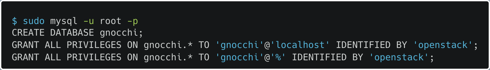

Переходим к настройке файла конфига **/etc/gnocchi/gnocchi.conf** сервиса **Gnocchi**:

Указываем параметры авторизации в **Keystone**:

Указываем параметры подключения к БД:

Указываем место в файловой системе, где будут хранится данные метрик (можно хранить локально, можно например в **Ceph**, если крутой, но я локально):

Инициализируем **Gnocchi**:

Запускаем и включаем все службы **Gnocchi**:

Переходим к сервису **Ceilometer** и качаем его службы:

Настраиваем файл конфига **/etc/ceilometer/ceilometer.conf** сервиса **Ceilometer**:

Указываем информацию по подключению к сервису **RabbitMQ**:

Указываем реквизиты сервиса **Ceilometer**:

Инициализируем **Ceilometer**:

Запускаем и включаем все службы **Ceilometer**:

Теперь качаем службы для сервиса **Aodh** (**python-aodhclient** модуль для работы с **Python**):

Создаем БД **aodh** для хранения информации о триггерах сервиса **Aodh**:

Настраиваем файл конфига **/etc/aodh/aodh.conf** сервиса **Aodh**:

Регистрируем сервис **Aodh** в **Keystone**:

Указываем параметры авторизации в **Keystone**:

Теперь указываем реквизиты самого **Aodh**:

И параметры подключения к БД **aodh** и **RabbitMQ**:

Синхронизируем БД **aodh** с сервисом:

Теперь можно запустить все службы:

12.3. Переходим к установке службы **openstack-ceilometer-compute** на рабочих (**compute.test.local**) узлах (для всех узлов действия одинаковы):

Устанавливаем службу **openstack-ceilometer-compute**:

Задаем параметры файлу конфига **/etc/ceilometer/ceilometer.conf** сервиса **Ceilometer**:

URL брокера сообщений **RabbitMQ**:

Указываем собственные реквизиты сервиса **Ceilometer**:

Указываем в конфиге **/etc/nova/nova.conf** сервиса **Nova**, чтобы он начал отправлять сообщения через брокер сообщений:

Настраиваем получение статистики по «**memory.usage**», «**disk.usage**» и «**disk.device.usage**»:

Запускаем службу **openstack-ceilometer-compute** и перезапускаем службу **openstack-nova-compute**:

12.4. Далее можно настраивать сервисы для отправки сообщений в сервис **Telemetry**. Я сделаю настройку сервисов **Glance** и **Cinder** (остальные сервисы [**тут**](https://docs.openstack.org/mitaka/install-guide-ubuntu/ceilometer.html)):

Настраиваем файлы конфигов служб (**/etc/glance/glance-api.conf** и **/etc/glance/glance-registry.conf**) **Glance**:

Настраиваем службу отправки сообщений для **Ceilometer** по AMQP и URL принимающего брокера сообщений (**RabbitMQ**) в конфиге (**/etc/glance/glance-api.conf**) **glance-api**:

Настраиваем URL принимающего брокера сообщений (**RabbitMQ**) в конфиге (**/etc/glance/glance-registry.conf**) **glance-registry**:

Перезапускаем настроенные службы **glance-api** и **glance-registry**:

Переходим к настройке конфига **/etc/cinder/cinder.conf** сервиса **Cinder** (если данный сервис находится на других узлах, то там его настройка аналогична):

Настраиваем службу отправки сообщений для **Ceilometer** по AMQP:

Можно создать **cron-службу** (выполняет что-то периодически), которая будет раз в 5 минут собирать информацию о сервисе (в официальной документации такого пункта нет):

Перезапускаем службы **Cinder**:

Все, теперь должны пойти метрики.

12.5. Посмотреть метрики можно при помощи [**следующих команд**](#bookmark=id.1t3h5sf), а мы перейдем к созданию воображаемого триггера.

Перед созданием немного инфы о триггерах. Во-первых, триггер может быть в 3 состояниях: «**Ok**», «**Тревога**» и «**Недостаточно** **данных**». Во-вторых, правила триггеров могут объединяться с помощью **AND** и **OR**. В-третьих, к триггеру можно привязать два типа действий: отправление **POST-запроса** на какой-то URL или запись в файл журнала (только при отладке, в реальной жизни нет).

Теперь создаем триггер **myalarm1** для ВМ c id **35923211-ec9d-4f0a-8d5c-2cec96a427d8** (у вас может быть другой id), подробная информация по созданию [**тут**](https://access.redhat.com/documentation/en-us/red_hat_openstack_platform/11/html/command-line_interface_reference/telemetry_data_collection_service_ceilometer_command_line_client#ceilometer_alarm_gnocchi_aggregation_by_metrics_threshold_update):

-   **--type** — тип триггера (в нашем случае срабатывание по определенному порогу метрик)
-   **--name** — имя триггера
-   **--metric** — имя метрики
-   **--aggregation-method** — метод объединения значений метрик (в нашем случае берется среднее значение за период)
-   **--comparison-operator** — тип сравнения (в нашем случае **greater equal** — больше равно )
-   **--threshold** — сравниваемое значение
-   **--evaluation-periods** — количество периодов после возникновения события, которые нужно подождать перед совершением действия
-   **--granularity** — длительность периода в секундах
-   **--alarm-action** — действие, совершаемое триггером
-   **--resource-type** — тип ресурса openstack
-   **--query** — параметры передаваемые действию (в нашем случае в журнал запишется id ВМ)

С триггерами все переходим к последнему сервису (ну как так-то их еще минимум 5, но в гайде в ближайшее время их не будет).

13\. Установка и настройка сервиса оркестрации Heat

13.1. Сервис **Heat** отвечает за автоматизацию управления жизненными циклами наборов облачных сервисов, объединяя их в так называемые стеки (**stack**). С помощью него можно как развернуть ВМ, так и стартовать комплексное приложение из многих машин и масштабировать его в зависимости от информации, передаваемой модулем телеметрии. Для описания стеков используются специальные описания ресурсов, их ограничений, зависимостей и параметров:

-   **HOT** (Heat Orchestration Template) – формат, предназначенный исключительно для OpenStack. Представляет собой документ формата YAML (с ним и работаем)
-   **CFТ** (AWS CloudFormation) – документ формата JSON в формате, совместимом с шаблонами сервиса [**CloudFormation**](http://aws.amazon.com/ru/cloudformation/). Нужен, чтобы работать с уже существующими для AWS [**шаблонами**](http://../%E2%80%A2%20https://aws.amazon.com/cloudformation/aws-cloudformation-).

Службы **Heat**:

-   **openstack-heat-engine** – основной сервис, обеспечивающий обработку шаблонов и отправляющий события пользователям API
-   **openstack-heat-api** – сервис, отвечающий за предоставление основного REST API Heat. Взаимодействует с **openstack-heat-engine** через вызовы RPC
-   **openstack-heat-api-cfn** – аналогичен **openstack-heat-api**, но обеспечивает работу с API, совместимым с **AWS CloudFormation**.
-   **heat cli** – интерфейс взаимодействия с **Heat** API. Помимо командной строки, разработчики могут напрямую вызывать REST API или использовать веб-интерфейс **Horizon**.

13.2. Приступаем к воображаемой установке и настройке служб **Heat**:

Устанавливаем необходимые службы на узел управления (python2-heatclient модуль для взаимодействия **Python** с **Heat**):

Создаем БД **heat**:

Регистрируем **Heat** в сервисе **Keystone**:

Уже что-то интересное, для **Heat** необходим отдельный домен **heat** для проектов и пользователей стека:

В новом домене heat создаем админа **heat_domain_admin**:

Создадим роли владельца стека **heat_stack_owner** и пользователя стека **heat_stack_user**. Также добавим роль владельца стека нашему пользователю **demo**:

Закончим регистрацию в **Keystone**, добавив два сервиса: **heat** (обычный **heat**) и **heat-cfn** (**heat** для **CloudFormation**). Ну и добавим точки входа в добавленные сервисы:

Приступаем к редактированию конфигурационного файла **/etc/heat/heat.conf**:

Прописываем путь к БД **heat**:

Указываем URL брокера сообщений (**RabbitMQ**):

Добавляем параметры авторизации в сервисе **Keystone**:

Добавляем реквизиты авторизации доверенного лица (**trustee**) в Keystone:

Указываем, что в запросах клиентах должен быть заголовок **authenticate_uri:**

Задаем URL сервера метаданных и сервера доступности ресурсов (показывает, когда можно создать ресурс, создание которого зависит от существования других ресурсов):

Указываем выделенный под запуск стеков домен и реквизиты администратора:

Синхронизируемся с БД **heat**:

Запускаем службы **Heat**:

Команда проверки работы сервисов — [**вот**](#bookmark=id.4d34og8).

13.3. Теперь можно создать первый стек, для этого на создать YAML-файл **test-server.yml** следующего содержания (cоздает стек, состоящий из одной виртуальной машины, которой во время старта передается скрипт, выводящий сообщение «Instance STARTED!» на стандартный вывод):

-   **heat_template_version** — версия шаблона **Heat** (соответствует дате релиза актуальной версии Openstack, в файле версия устарела)
-   **description** — описание шаблона
-   **parameters** — определение переменных окружения (параметров), для дальнейшего использования
    -   **network** — параметр сети
        -   **type** — тип параметра (в данном случае строка)
        -   **description** — описание параметра
        -   **default** — дефолтное значение параметра, если через флаги команды создания стека не передано другое значение
    -   **image** — параметр образа
-   **resources** — описание ресурсов шаблона
    -   **my_server** — имя ресурса
        -   **type** - тип ресурса (в данном случае ВМ (**server**))
        -   **properties** — определение параметров ВМ my_server
            -   **flavor** — тип тома ВМ
            -   **key_name** — пара SSH ключей ВМ
            -   **networks** — массив сетей подключаемых к ВМ
                -   **network** — сеть подключенная к ВМ
                    -   **get_param** — получение переменных окружения (параметров)
            -   **image** — базовый образ ВМ
            -   **user_data** — действия выполняемые при запуске ВМ (в данном случае запуск скрипта)
            -   **user_data_format** — формат, в котором были записаны действия (в данном случае в виде строки)
-   **outputs** — параметры выводимые пользователю в **Horizon** или через API
    -   **instance_name** — название ВМ
        -   **description** — описание параметр
        -   **value** — значение параметра
            -   **get_attr** — получение значения атрибута ресурса (задается имя ресурса (**my_server**) и конкретный атрибут (**name**))
    -   **private_ip** — плавающий IP ВМ

Теперь можно создать стек используя созданный YAML-файл:

-   **--parameter** — передать значение параметра
-   **-t** — использовать файл шаблона

[**Данная команда**](#bookmark=id.3dy6vkm) показывает статус создания стека.

Также можно посмотреть создалась ли ВМ, а также информацию о ней:

Проверка срабатывания скрипта:

После чего можно посмотреть список ресурсов стека и потом его удалить:

14\. Что происходит под капотом Neutron (бонусная глава)

14.1. Давайте выясним как у нас в кластере на самом деле создаются сети и почему на рабочих узлах достаточно одного сетевого интерфейса. Для начала разберемся, что из себя представляет **Open vSwitch** (виртуальный коммутатор), а также **сетевые пространства имен**:

14.2. **Сетевые пространства имен** являются одной из разновидностей **пространств имен Linux** (придуманы, чтобы изолировать друг от друга процессы), которые включают в себя:

-   **PID**, Process ID – изоляция иерархии процессов
-   **NET**, Networking – изоляция сетевых интерфейсов
-   **PC**, InterProcess Communication – управление взаимодействием между процессами
-   **MNT**, Mount – управление точками монтирования
-   **UTS**, Unix Timesharing System – изоляция ядра и идентификаторов версии

Так вводим три следующие команды (список **сетей** и **маршрутизаторов** **openstack**, а также список **сетевых пространств Linux**) и анализируем вывод;

Что же мы видим, а именно, что служба **neutron-l3-agent** создает сетевые пространства для каждой сети (**qdhcp-id**) и маршрутизатора (**qrouter-id**) **Openstack** (id совпадают), но только для тех, к которым подключены ВМ напрямую (сетевого пространства **ext-net** нет). Также стоит отметить, что сетевые пространства автоматически не удаляются.

С сетевыми пространствами все.

14.3. Итак, **Open vSwitch**, данная технология состоит из следующих компонентов:

-   **Openswitch_mod.ko** — модуль ядра, отвечающий за работу с пакетами
-   **Ovs-vswitchd** — демон, отвечающий за управление, программирование логики пересылки пакетов, VLAN’ы и объединение сетевых карт
-   **Ovsdb-server** — сервер базы данных, отвечающий за ведение базы данных с конфигурацией
-   **Контроллер SDN** (Software Defined Network) — API сервер для работы с коммутатором
-   OpenFlow — протокол, при помощи которого **контроллер SDN** может удаленно контролировать таблицы потоков на коммутаторах и маршрутизаторах

В совокупности все это выглядит так:

Основные команды для работы с Open vSwitch:

-   **ovs-vsctl show** – вывод общей информации по коммутатору
-   **ovs-vsctl add-br/del-br** – добавить или удалить мост
-   **ovs-vsctl add-port/del-port** – добавить или удалить порт
-   **ovs-ofctl dump-flows** – вывод запрограммированных потоков для конкретного коммутатора (за их определение отвечает служба **neutron-openvswitch-agent**)
-   **ovsdb-tool show-log** – все команды настройки, отданные OVS, при помощи утилит пространства пользователя (с ее помощью **Neutron** работает с Open vSwitch)

Теперь сравним вывод списка портов **openstack** с выводом конфигурации **Open vSwitch** (на **controller** и **compute** узлах). Вывод **Open vSwitch** я немного подрезал:

Тааак, в первую очередь можно заметить, что на узле управления у нас находятся три моста (**br-int**, **br-tun** и **br-ex**), а на рабочем узле, где запущена ВМ два моста (**br-int** и **br-tun**). Что из себя представляют данные мосты:

-   **Br-int** – интеграционный мост, предназначенный для подключения ВМ. Он осуществляет VLAN-тегирование трафика приходящего с/на вычислительные узлы. Находится как на вычислительных так и сетевых (у меня управляющем) узлах и создается автоматически при первом старте **neutron-openvswitch-agent**. На управляющем узле к нему подключены шесть портов:
    -   **tapef1fc61d-56** — порт моста к ВМ **myinstance1** (ip моста — **172.16.0.2**), для **testvm** нет моста, так как она в данный момент выключена
    -   **patch-tun** – соединение с мостом **tun**
    -   **qr-a3b98aca-13** – подключение к единственному маршрутизатору (ip маршрутизатора в подсети — **172.16.0.1**)
    -   **qg-106645c0-cd** — подключение к внешнему шлюзу маршрутизатора (ip внешнего шлюза в настройках маршрутизатора — **10.100.0.121**)
    -   **int-br-ex** – подключение к мосту **br-ex**
    -   **br-init** — собственный порт моста **init**
-   На рабочем узле есть четыре порта:
    -   **qvo87118d9b-84** — интерфейс ВМ **myinstance1** (локальный ip ВМ — **172.16.0.25**)
    -   **qvo9c0640c5-92** — интерфейс ВМ **testvm** (локальный ip ВМ — **172.16.0.72**)
    -   **patch-tun** — аналогично управляющему узлу соединение с мостом **tun**
    -   **br-int** — аналогично управляющему узлу порт моста **init**
-   **br-tun** – в нашем случае это GRE-туннель. Связывает сетевые и вычислительные узлы, передавая тегированный трафик с интеграционного моста, используя правила OpenFlow. Имеет следующие порты (на обоих узлах):
    -   **gre-c0a87ad7** — gre-туннель до узла **compute-opt**
    -   **gre-c0a87ac8** — gre-туннель до узла **controller**
    -   **gre-c0a87ad2 —** gre-туннель до узла **compute**
    -   **br-tun** — собственный порт моста **tun**
    -   **patch-int** — подключение к мосту **br-int**
-   **Br-ex** – мост, осуществляющий взаимодействие с внешним миром. Существует только на сетевых (управляющих) узлах. Содержит порты:
    -   **eth1** — физический сетевой интерфейс
    -   **phy-br-ex** — порт связи моста и физического сетевого интерфейса
    -   **br-ex** — собственный порт моста **ex**

Вот так можно посмотреть сетевые пространства имен нашего виртуального маршрутизатора:

14.4. Из-за того, что **Open vSwitch** не может работать с правилами iptables, которые применяются на виртуальный интерфейс, непосредственно подключенный к порту коммутатора, группы безопасности (набор настраиваемых разрешающих правил прохождения трафика, которые возможно назначать на порты) применяются к мосту **qbr-id** с помощью [**LinuxBridge**](https://kbespalov.medium.com/%D0%B2%D0%B8%D1%80%D1%82%D1%83%D0%B0%D0%BB%D1%8C%D0%BD%D1%8B%D0%B5-%D1%81%D0%B5%D1%82%D0%B5%D0%B2%D1%8B%D0%B5-%D1%83%D1%81%D1%82%D1%80%D0%BE%D0%B9%D1%81%D1%82%D0%B2%D0%B0-%D0%B2-linux-linux-bridge-7e0e887edd01) (что-то типо костыля), выведем все мосты рабочего узла:

Тут видно три моста:

-   **qbr87118d9b-84** — мост к ВМ **testvm**
-   **qbr9c0640c5-92** — мост к ВМ **myinstace1**
-   **virbr0** — мост к хост машине

Посмотрим правила брандмауэра (на самом деле команды, которые автоматически ввела служба **neutron-openvswitch** при создании ВМ) для интерфейса **tap9c0640c5-92** (сетевой интерфейс ВМ **myinstace1**) с помощью [**iptables**](https://linux.die.net/man/8/iptables) (**-S** — все правила):

-   **-A** — добавить правило в цепочку с именем (например **neutron-openvswi-FORWARD**)
-   **-m** — имя дополнительного используемого модуля (**physdev** — модуль устройств ввода и вывода порта моста, **comment** — модуль добавления комментариев)
-   **--physdev-out** — имя порта моста, через который будет отправлен пакет
-   **--physdev-in** — имя порта моста, через который принимается пакет
-   **--physdev-is-bridged** — пакет передается по мосту и не маршрутизируется
-   \-**-comment** — содержимое комментария к правилу
-   **-j** - имя цели (цепочки) правила (что делать с пакетом, в нашем случае прейти к цепочке с таким-то именем). Вот вывод инфы о цепочке входящего в ВМ трафика:

Тут видно нашу настройку приема **icmp** пакетов, **ssh** подключений, а также дефолтный прием всех **udp** пакетов на ip ВМ, ну и правила работы с разными тегами трафика (**RELATED** (пакет начинает новое соединение (например **FTP**), но связан с существующим соединением. **принимаем**), **ESTABLISHED** (пакет связан с соединением, которое видело пакеты в обоих направлениях. **принимаем**), **INVALID** (пакет связан с неизвестным соединением. **отбрасываем**) и **все остальное** (отправляет в цепочку **neutron-openvswi-sg-fallback**)).

Вот так должна выглядеть наша сеть (**qvb** - подключение в сторону моста **qbr**, **qvo** - подключение в сторону **OVS**):

Ну вроде все единственное, что можно сказать это что у **openstack** есть служба openstack-neutron-fwaas (файерволл как сервис), которая помогает снизить нагрузку на сетевые интерфейсы ВМ, оправляя им уже проверенный трафик.

14.4. Для того чтобы красиво визуализировать сеть узла можно скачать специальную утилиту сканирования сети **plotnetcfg**, которая создаcт конфиг сети, после чего визуализировать этот конфиг в виде схемы при помощи утилиты **dot**, входящей в пакет **graphviz** (можно скачать на каждый узел, чтобы составить их схемы, но я скачаю только на узел **compute**).

Перед установкой пакетов надо опять [**включить**](#bookmark=id.tyjcwt) репозиторий epel, который мы вырубали. После чего надо скачать пакеты **plotnetcfg** и **graphviz**:

Теперь можно визуализировать сетевую конфигурацию узла **compute** (-T — тип файла, в который сохранится схема):

Скачиваем на хост машину файл и смотрим че вышло:

Скрин части схемы (**eth1** мне было просто лень убрать, так-то его не должно быть на вычислительном узле):

14.5. Еще интересная тема так называемый мониторинг трафика ВМ. Попробуем проанализировать трафик нашей ВМ **myinstance1**:

Запускаем из ВМ поток пакетов ICMP на ip виртуального маршрутизатора (и не останавливаем):

Теперь заходим на узел, на котором она поднялась, качаем [**tcpdump**](https://andreyex.ru/linux/komanda-tcpdump-v-linux/) (**-n** — начать сразу же, **-p** — выводить все в консоль, **-i** — имя интерфейса **-vvv** — очень детальный вывод, **-s** — размер снимка пакета, **-w** — записать в файл) и пытаемся перехватить трафик (интерфейсы **patch-tun** и **br-int**) ВМ (должны вылезти ошибки):

Почему же вылезают ошибки, а потому что внутренние устройства **Open vSwitch** невидимы для большинства утилит за пределами OVS, так как **Open vSwitch** не может работать с правилами **iptables**, которые применяются на виртуальный интерфейс, непосредственно подключенный к порту коммутатора (из-за этого все больше любят **Linux Bridge**, с которым таких проблем нет). Поэтому люди придумали костыль, а именно **dummy-интерфейс** (локальный интерфейс, тоже самое что и **loopback**), который будет зеркалировать весь трафик моста  **br-int**.

Создаем интерфейс **br-int-tcpdump** и поднимаем его:

Добавляем созданный интерфейс **br-int-tcpdump** к мосту **br-int**:

Он должен появится в конфиге OVS в секции моста **br-int** (управляющего узла):

Теперь настраиваем зеркалирование всего трафика с мста **br-int** на интерфейс **br-int-tcpdump** (эта сложная команда включает в себя 4 подкоманды, которые передают друг другу значения):

-   **mirrors** — список зеркалирований интерфейса
-   **--id=@имя_переменной** — локальная переменная, в которую запишется вывод подкоманды
-   **name** — имя зеркалирования
-   **select-dst-port** — интерфейс, на который приходят пакеты
-   **select-src-port** — интерфейс, с которого приходят пакеты
-   **output-port** — интерфейс, на который пакеты будут зеркалироваться
-   **select_all** — все пакеты, если 1

Теперь трафик должен начать перехватываться (его можно записать в файл, скинуть на хост машину и проанализировать, например, в [**Wireshark**](https://habr.com/ru/post/204274/)):

14.6. Ну что ж последний пункт затрагивает такое понятие как балансировщик нагрузки как сервис (**LbaaS**). Вроде у **Openstack** уже есть свой сервис балансировки нагрузки по имени **Octavia**, но я последую книге и разверну [**HAProxy**](https://wiki.astralinux.ru/pages/viewpage.action?pageId=61573337) (подключаемый модуль **Neutron**). Балансировщик нагрузки отвечает за балансировку входящих сетевых подключений между экземплярами виртуальных машин, входящих в один кластер, чтобы не было такого, что одна ВМ задыхается от запросов, пока вторая не знает чем ей заняться. Далее в книге была показана конфигурация HAProxy, в ходе которой я выяснил, что его уже никто почти не использует, так как есть **Octavia**, так что пункт отменяется до момента настройки мной данного сервиса.

Пока можно сказать три вещи:

-   Есть три типа политики балансировки нагрузки:
    -   подключения принимаются по очереди всеми виртуальными машинами
    -   с одного IP-адреса подключения принимает одна и та же виртуальная машина
    -   подключение принимает машина с наименьшим числом подключений
-   Lbaas создает сетевые пространства имен для ВМ в так называемом пуле балансировки
-   Порядок организации балансировки нагрузки для нескольких ВМ:
    -   Создается специальный пул, в котором все ВМ будут делить запросы
    -   В пул добавляются ВМ по их ip
    -   Создается сервис мониторинга доступности ВМ
    -   Создается виртуальный ip пула
    -   Виртуальному ip пула добавляется плавающий ip, чтобы к кластеру можно было подключаться извне
    -   Таким образом запросы приходят на плавающий ip и распределяются согласно политике между участниками пула

Поздравляю господа, на этом минимальную настройку можно объявить законченной.

